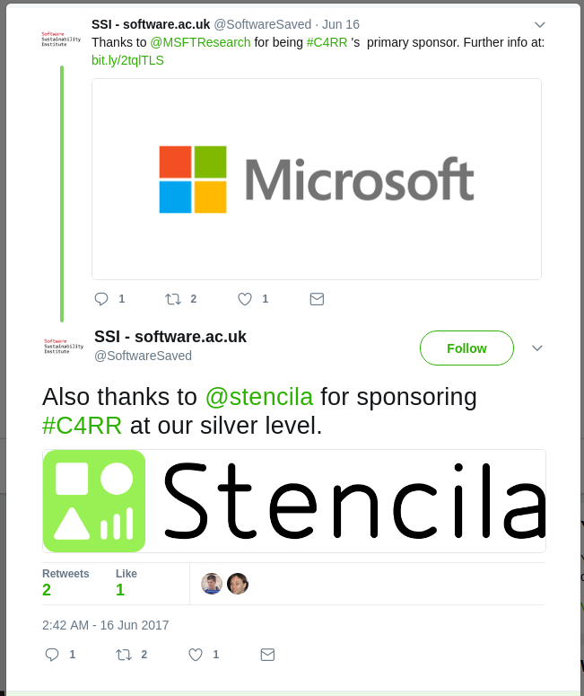

We are very happy to announce our sponsorship for C4RRR! The topic of containers for Reproducible Research has been a focus for many community
members. Here is what the Software Sustainability Institute is saying about the event:

> Containers, specially Docker and Singularity, is the hottest topics at the moment for reproducible research. What impact does the use of containers have on research, how can researchers benefit from them and make their research more reproducible? The Software Sustainability Institute invites all members of the research software community to explore and discuss these and other questions at C4RR.

> Containers refers to a server virtualisation method that is lighter than virtual machine what allows a quicker launch time for applications and more concurrent instances running on the same server. Researchers currently use Docker, one of the container implementations available on the market, to package the software used in their research so other, including their future self, can reproduce the computational environment used in an experiment. Another scenario where researchers are using Docker is when some software libraries aren’t available on all operating system so users can rely on containers to launch the software in less time than it makes to make a cup of coffee! A third scenario is when researchers do high performance computing on clusters. Each machine of the cluster needs to have the software installed and as demonstrated by some researchers and HPC research software engineers the use of containers, such as Singularity, is a great time saver.

