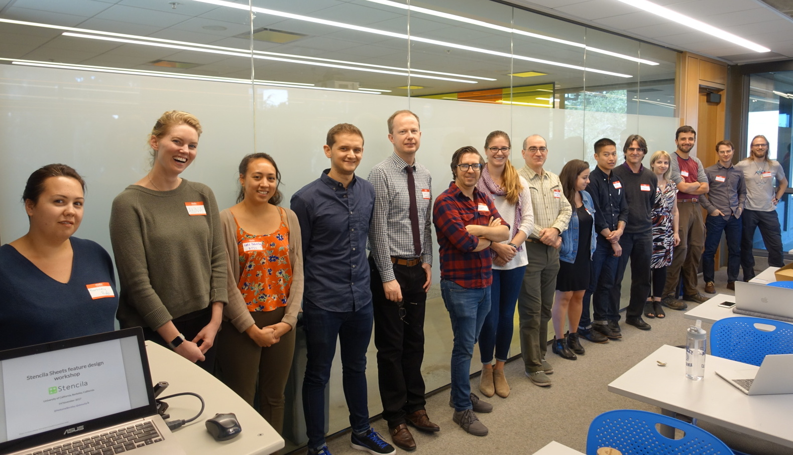
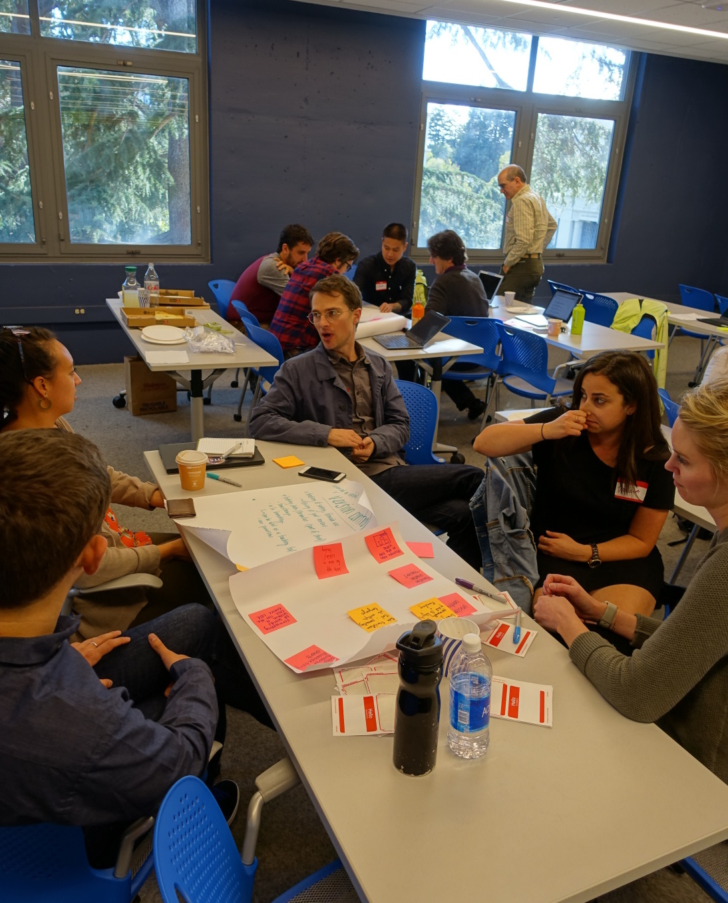
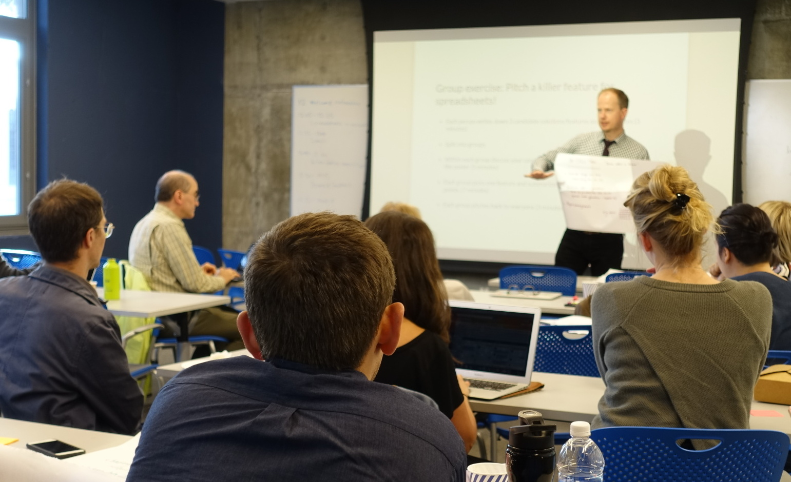
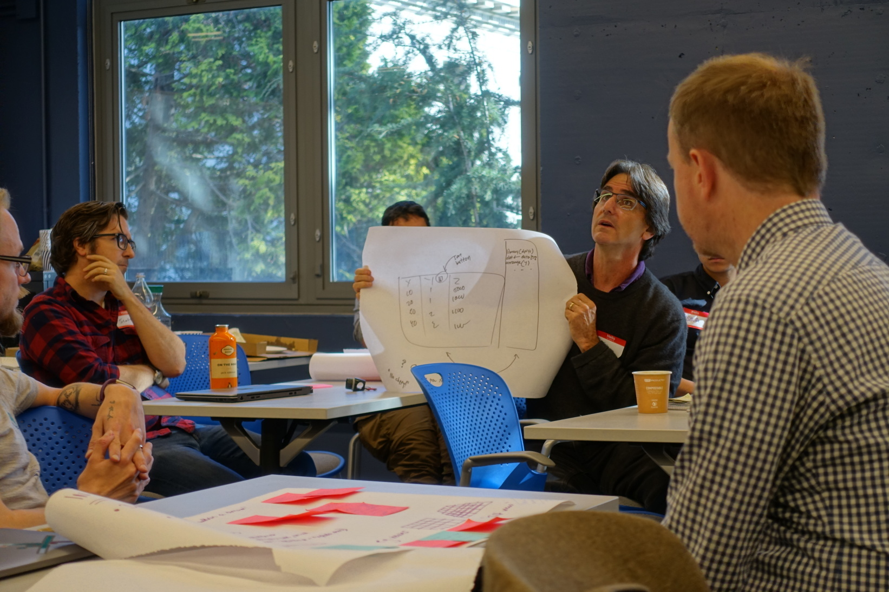
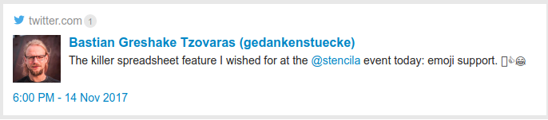
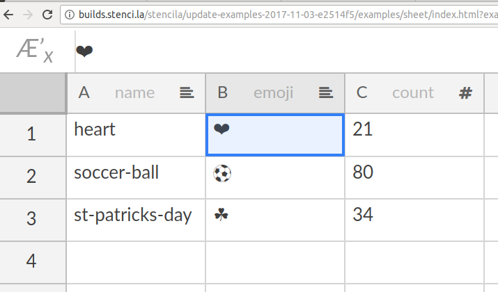
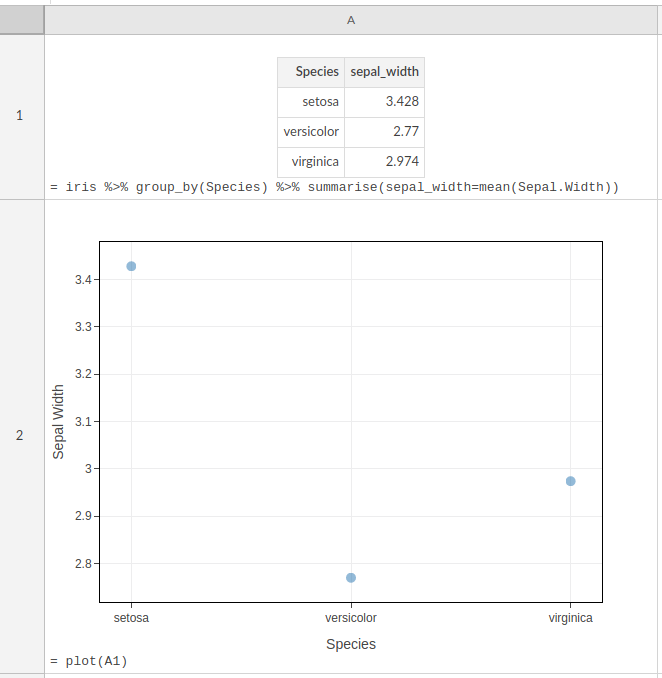

The University of California Berkeley (UCB) was the setting for the fourth workshop on Stencila Sheets. UCB needs little introduction. It's one of the world's most prestigious universities and home to an impressive number of Nobel laureates. It's also home to several leading open source projects for open science including [Jupyter](http://jupyter.org/), [Pandoc](https://pandoc.org/) and [ROpenSci](https://ropensci.org/).

A big thank you to Amy Neeser and John Chodaki for helping us organise the event. We had a great group come along including people from [Berkeley Initiative for
Transparency in the Social Sciences](http://www.bitss.org/), [California Digital Library](http://www.cdlib.org/), [D-lab](http://dlab.berkeley.edu/), [University of California Press](https://www.ucpress.edu/) and [Open Humans](https://www.openhumans.org/). As usual, we started with our "When did you last use a spreadsheet?" icebreaker...

{style="width: 70%;" }
_The "When did you last use a spreadsheet?" "lineup" (These suspects did report having used a spreadsheet recently but are not under suspicion for any other crimes)_ :slight_smile:

### Killer spreadsheet feature competition

After some discussion about the goods and bads of spreadsheets (and a pizza lunch) we got into the "Killer spreadsheet feature competition" in which three teams came up with a killer feature for spreadsheets and pitched them to the rest of the group (and were then given pretty much random, meaningless, scores)...

{style="width: 70%;" }
_Team Versioning pitched better version control for spreadsheets. Something more sophisticated than in Google Sheets (e.g. commit messages, diffing etc) but easier to use than Git. They got a score of 6 (the percentage of Enron emails that attached a spreadsheet and which included the words "error" or "fault")_

{style="width: 70%;" }
_Team In-cell-tion ([table within a table](https://en.wikipedia.org/wiki/Inception)) pitched a 3d layered spreadsheet that allowed different versions of the data to be seen in different layers. They scored 60 (the estimated number of copies of Microsoft Office sold every minute)._

{style="width: 70%;" }
_Team Translate's idea was to do automatic translation of a spreadsheet into a Python or R script. They were the eventual winners with a score of 750, 000, 000 (the estimated number of Excel users worldwide)!_

### Other ideas

There were lots of other ideas that came up during the workshop including Bastion's wish for better emoji support:

I thought that was a great idea, so after the workshop was pleased (and a little surprised) that Stencila Sheets already supports UTF8 emoji cell values:

{style="width: 50%;" }

Oh, and for "Team In-cell-tion" (:heart: the name!) I couldn't help but give you a screenshot of a "table-within-a-table". In this Stencila Sheet (shown in "maximal" view mode so you can see the code and the result), cell `A1` is an R expression which uses the package `dplyr` to create a summary table within a cell. The cell A2, then plots that summary.

{style="width: 50%;" }

### Thank you

A big, big thank you to all those who took time out of your day to come along. We really value your input and will use your feedback as we iterate toward a release of Stencila Sheets early next year.
