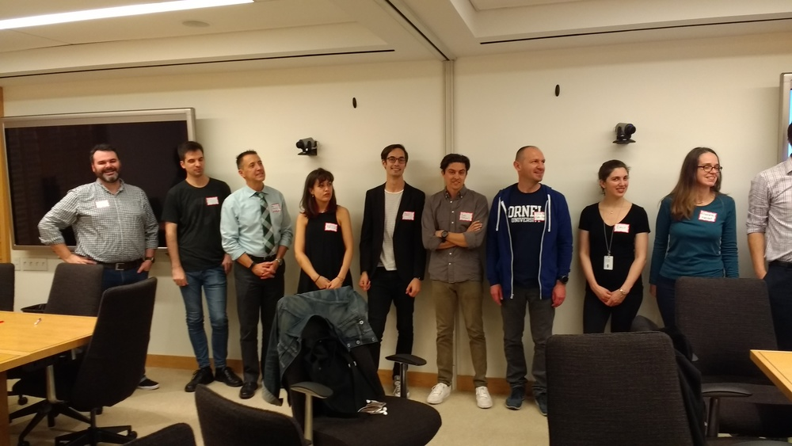
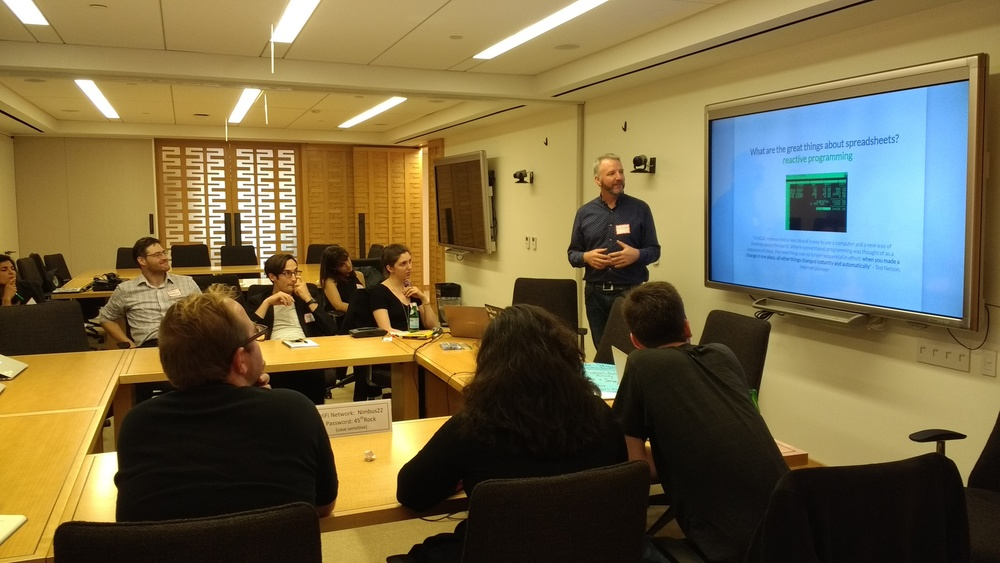
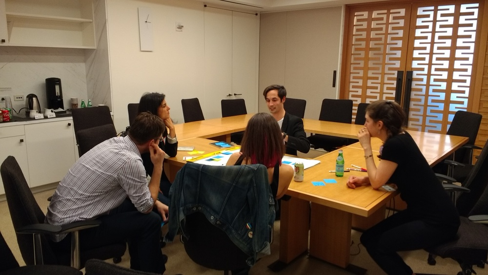

Last week Nokome Bentely and April Clyburne-Sherin from the Centre for Open Science hosted events in New York City including a visit to [ProPublica](https://www.propublica.org/) and the first of six (6!) user feedback sessions - graciously hosted by the [Alfred P. Sloan Foundation](https://sloan.org/). Feedback session participants included librarians, researchers, data journalists, data educators, data scientists, and more. As an icebreaker, April had everyone row up according to the last time they'd used a spreadsheet. Answers ranged from minutes ago to weeks.

Nokome introduced the project along with some of the reproducibilty issues in spreadsheets.

And small groups broke out to develop their own "killer features" for spreadsheets to be pitched back to the group.

We got some great feedback from participants - more on that once we have time to catch a breath. Today, Nokome spoke at [OHSU's Data Science Institute](https://ohsulibrary-datascienceinstitute.github.io/) and tomorrow we are headed to the [University of Oregon in Eugene](https://ti.to/codeforscience/stencila-at-university-of-oregon)!

If you're in [Eugene](https://ti.to/codeforscience/stencila-at-university-of-oregon), [Portland](https://ti.to/codeforscience/stencila-at-oregon-health-and-science-university), [Santa Barbara](https://ti.to/codeforscience/stencila-at-nceas), [Berkeley](https://ti.to/codeforscience/stencila-at-uc-berkeley), or [LA](https://ti.to/codeforscience/stencila-at-ucla) - we're coming to your town! Hope to see you at one of our upcoming sessions - and please share with your colleagues and students! If your location isn't on that list, we'll be back around in 2018 so let us know if you'd like a visit.
