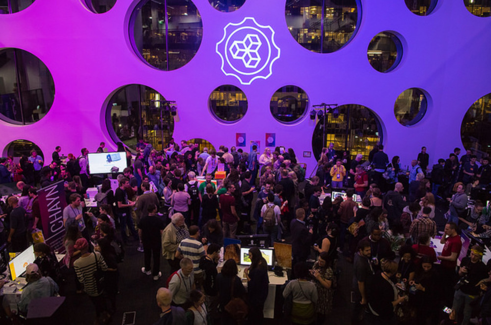
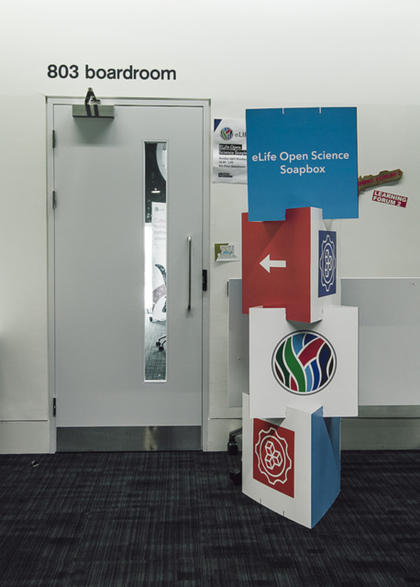
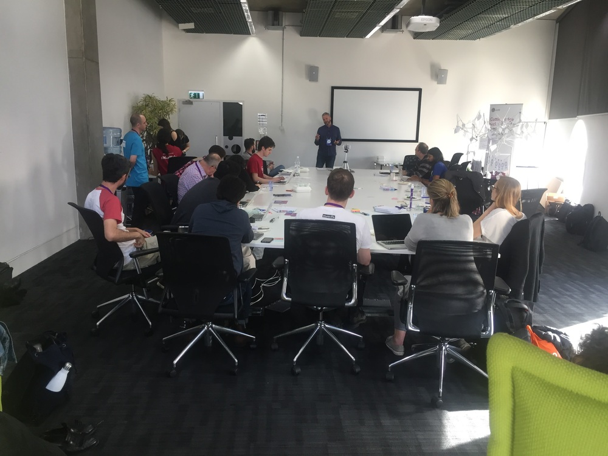
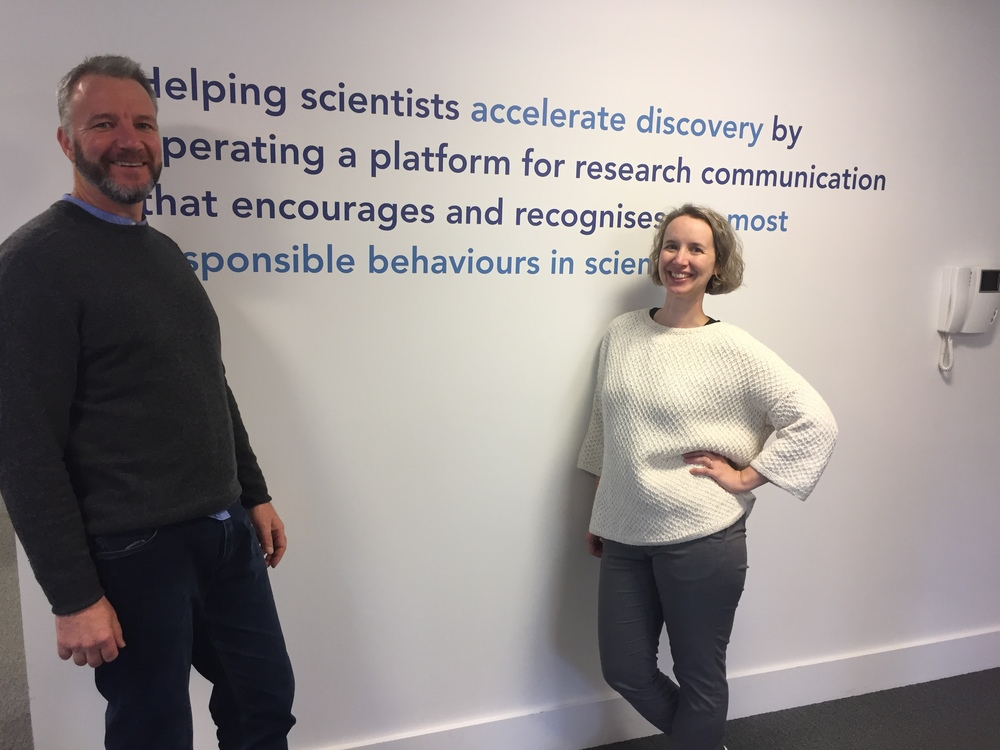
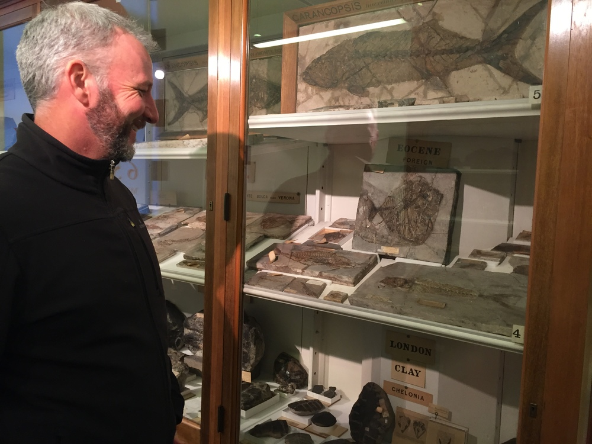
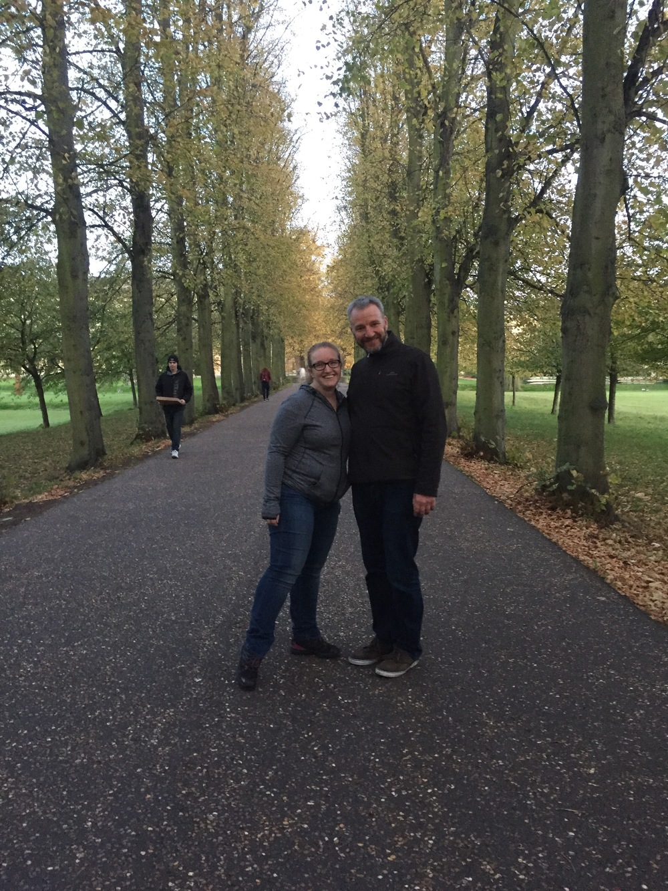
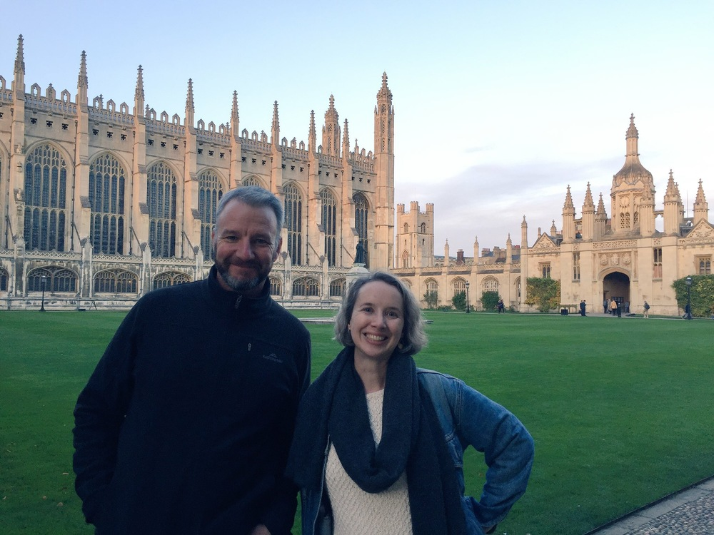

[Mozfest](https://mozillafestival.org/) is a unique experience. Hard to describe and even harder to plan for, it's a 3 day wild ride of open source/science/access/education/web/politics communities coming together. Nokome and myself jumped in to join the scrum to learn about new projects, connect with old friends, and meet new colleagues.

Photo by Erik Westra / Westra & Co under CC BY-NC 2.0
{.caption}

We joined eLife Innovation's [Open Science Soapbox session](https://elifesciences.org/events/cfcefcae/elife-at-mozfest-2017), a lively session of lightning talks by open projects that focus on the scientific and scholarly research space. [PREreview](https://www.prereview.org/), a new forum to support students and postdoc journal clubs to review preprints and share their feedback with authors. [Open the North](https://github.com/Monsauce/Open-the-North) seeks to build a mobile app for the [Guide to the Guide to Eating Ontario Fish](https://www.ontario.ca/page/eating-ontario-fish-2017-18) to make these data accessible to far northern communities.

{style="width: 50%;" }
Photo by Erik Westra / Westra & Co under CC BY-NC 2.0
{.caption}

[The Dat Project](https://datproject.org/), also under the [Code for Science & Society](codeforscience.org) non-profit presented [Dat in the Lab](https://blog.datproject.org/tag/science/), an initiative to develop and pilot Dat-based workflows for data sharing and publishing in research labs. The amazing Marcos Vital presented his [TeachR](https://github.com/marcosvital/teach-R-project) project. It was an energetic session with so many inspiring projects we'll be following!

Nokome Benltey presents Stencila to the eLife Open Science Soapbox group.
{.caption}

We also checked out the [Whitaker Lab's](https://github.com/WhitakerLab) [Brain Networks in Python](https://github.com/WhitakerLab/BrainNetworksInPython) session where we learned about how cognitive neuroscience uses python through a hands on reproduction of the analysis of a network neuroscience paper. We got the chance to learn more about [Beaker Browser](https://beakerbrowser.com/), a decentralized web browser built on Dat, from developer [Tara Vancil](https://taravancil.com/about/). By the end of the conference, we were exhausted. We met many new friends and colleagues interested in reproducible research and left feeling inspired and full of new ideas for collaboration.

From Mozfest, the Stencila world tour rolled on to Cambridge. Nokome and I visited the eLife offices where user experience designer Nick Duffield (more on Nick's work at eLife [here](https://elifesciences.org/labs/fc2e10b3/redesigning-an-online-scientific-journal-from-the-article-up-i-early-designs)) has been conducting user testing. I sat in on a session and will now forever think "what would Nick do?" when observing people interact with software. Thank you eLife for working with us!

We then toured Cambridge with [Kirstie Whitaker](https://kirstiewhitaker.com/) where we saw ancient fossilized fish, undergraduates punting around, and lawns upon which one should not even think of walking.

{style="display: inline; width: 50%; margin: 0 auto; padding-right: 1em; float: left;" }

{style="display: inline; width: 50%; margin: 0 auto; float: left;" }

Thanks Kirstie for the fantastic tour of Cambridge. Stay tuned for more from the New York City stop of the world tour this week!

More Mozfest photos [here](https://www.flickr.com/photos/mozfest/albums/72157686681997682/with/37961424882/).
