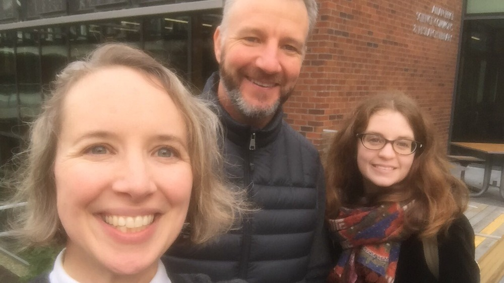
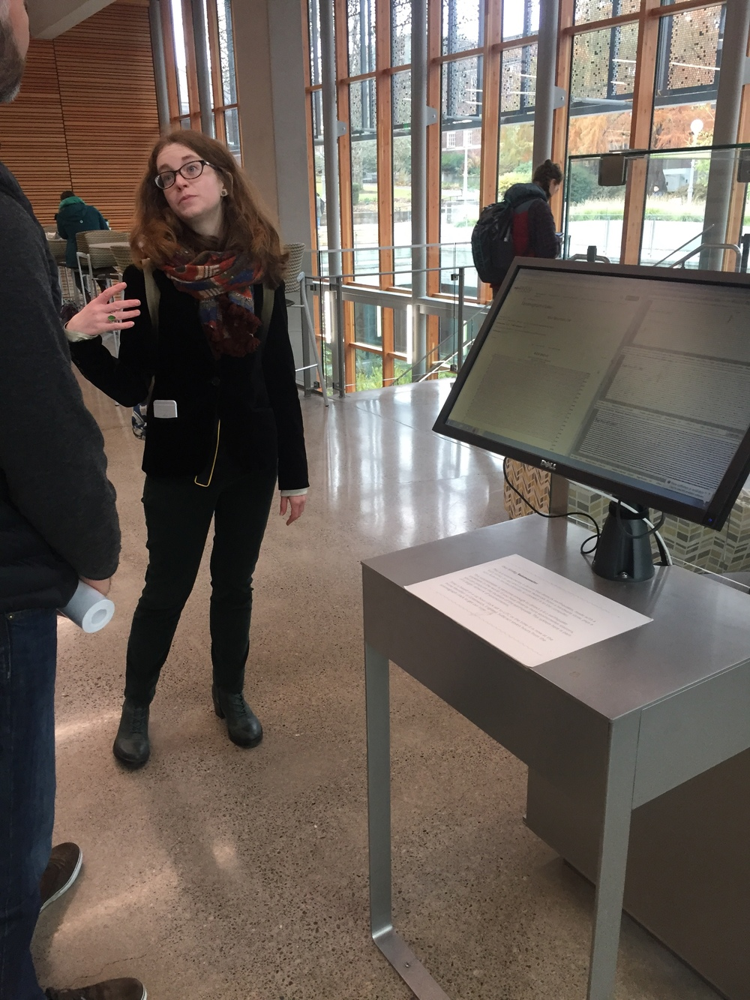
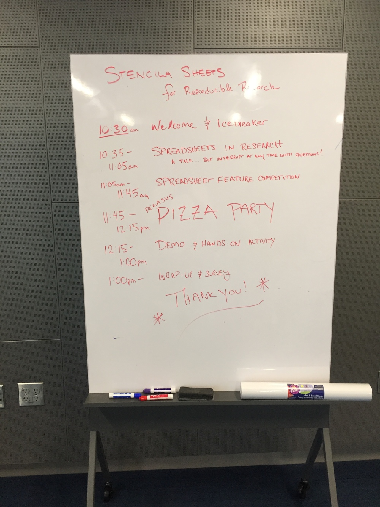
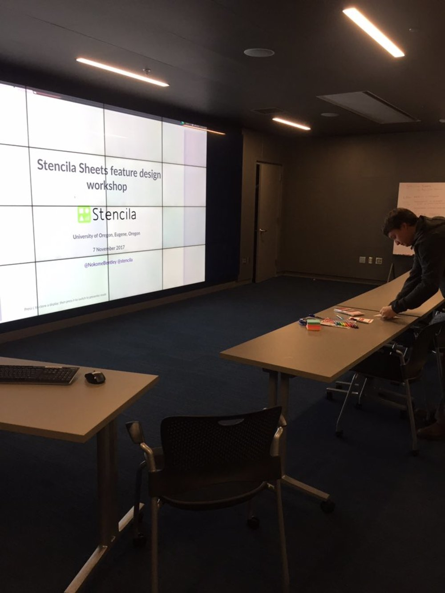
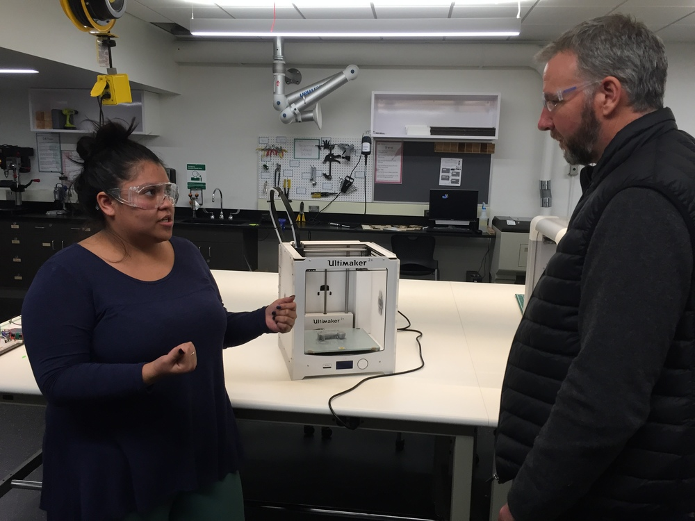
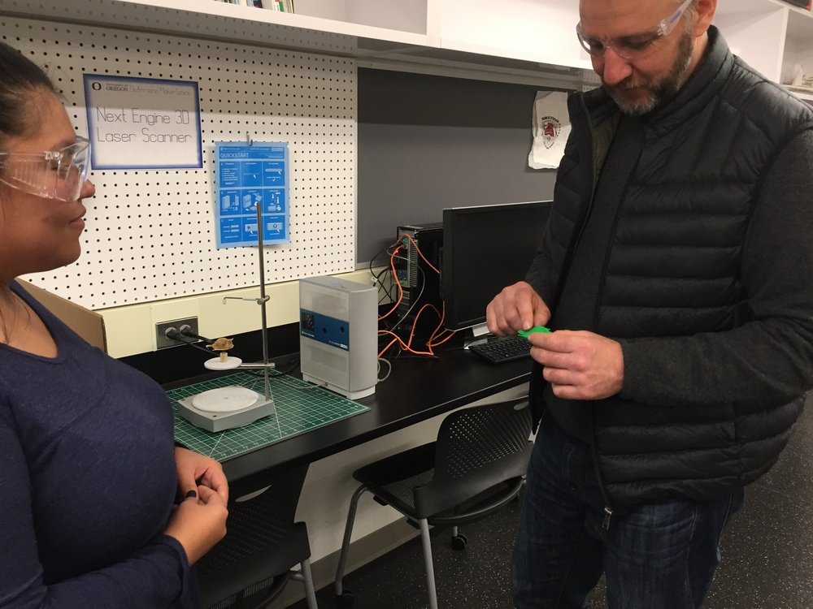

Today we drove from Portland down to the college town of Eugene, Oregon where we were hosted by the University of Oregon Data Services Librarian [Jonathan Cain](http://walecain.com/) and Digital Metadata Collections Librarian [Sarah Seymore](https://twitter.com/SarahESeymore).

Sarah showed us around the [Alan Price Science Commons and Research Library](https://library.uoregon.edu/price-science-commons-research-library).

{style="width: 70%;" }

Including a stop at the seismometer!

{style="width: 70%;" }

We set up for our workshop, which included a pizza party!

{style="width: 70%;" }

And kicked things off on the BIG SCREEN. Spreadsheets have never looked so good!

{style="width: 70%;" }

After an engaging and informative session with lots of post it notes, good questions, and feedback - more on that in a later post - we toured the [DeArmond MakerSpace](https://library.uoregon.edu/scilib/psc-dearmond-makerspace). Our tour guide, [Melissa Galvan](https://around.uoregon.edu/student-jobs-melissa-galvan) schooled us on laser cutters, 3D printers, laser scanners, fancy sewing machines, milling machines and more - thanks Melissa for an awesome tour!

{style="width: 70%;" }

Here's Nokome examining a laser printed copy of a laser scanned boxfish!

{style="width: 70%;" }

Thanks to everyone we met at the University of Oregon - we really appreciate you taking the time to talk about reproducibilty, spreadsheets, and Stencila. See you next time!
