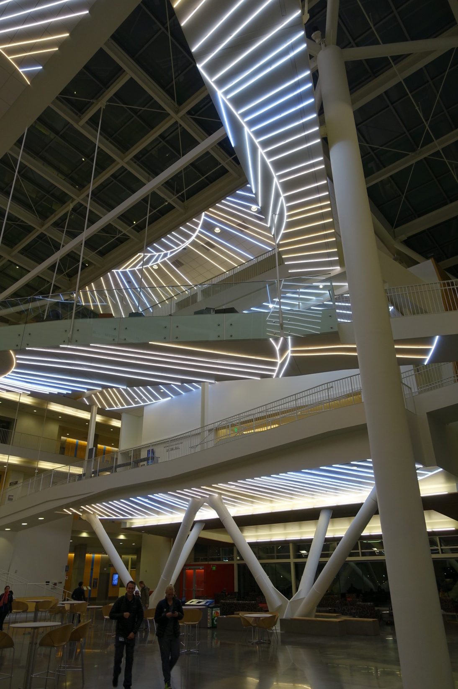
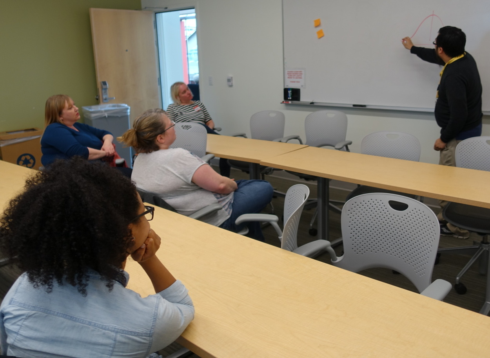
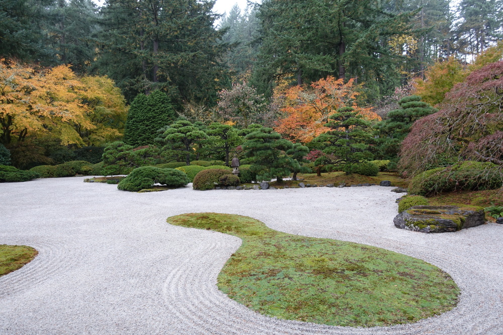

Our week in Portland, Oregon began with a day at the Oregon Health and Science University (OHSU) [Data Science Institute](https://ohsulibrary-datascienceinstitute.github.io/). Slides from our presentation are available [here](https://stencila.github.io/slides/2017-11-06-ohsu/#1). Thanks to the facilitators Nicole Vasilevsky, Jackie Wirz, Robin Champieux, Letisha Wyatt and Laura Zeigen for organising a great event and for hosting us!

On Friday, the very cool looking OHSU [Collaborative Life Sciences Building (CLSB)](http://portlandtribune.com/pt/9-news/225430-87797-collaborative-life-sciences-building-celebrated) was the venue for the third workshop on our current [road trip](https://community.stenci.la/t/stencila-community-roadmap/).

{style="width: 50%;" }

Thanks to Asia Mitchell and [Ted Laderas](https://twitter.com/tladeras) for hosting us and to everyone for their ideas and feedback. These workshops are proving to be invaluable for helping us determine feature priorities for Stencila!

{style="width: 70%;" }

Thanks to [Scott Chamberlain](https://community.stenci.la/u/sckott) for riding his bike in the Portland rain to meet us for a great catch up over lunch, and to Danielle Robinson and Max for all your help and for hosting me in your home town. Looking forward to reciprocating in Aotearoa New Zealand!

Oh, and if you're in Portland and have a spare couple of hours, the [Japanese Garden](https://japanesegarden.org/), apparently considered to be one of the best outside of Japan, is a great place to get away from the laptop screen.

{style="width: 70%;" }
