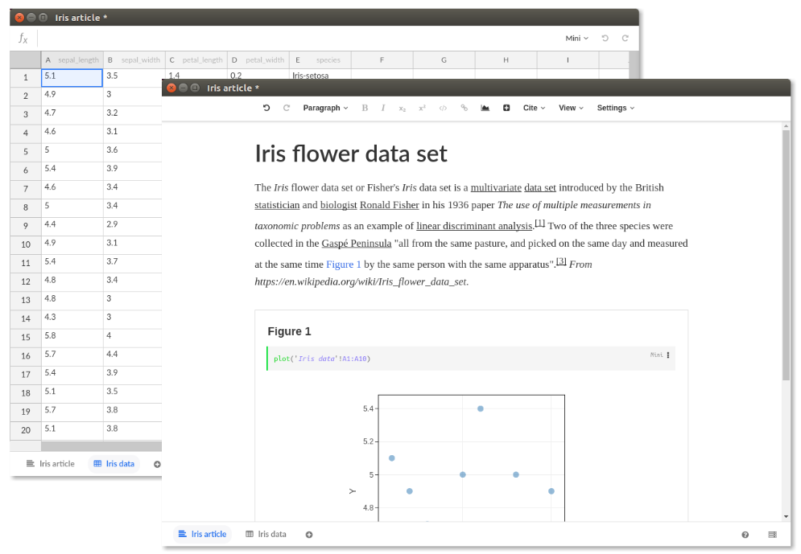
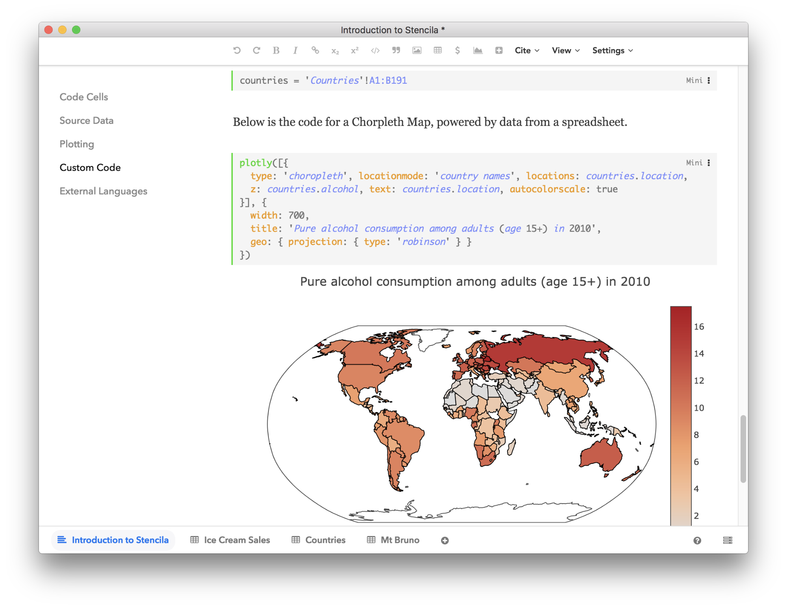
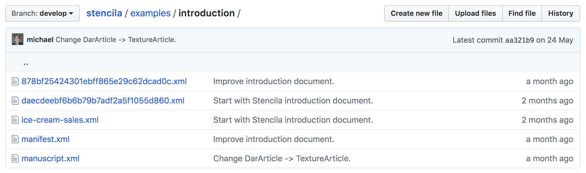

> _This blog post was originally published on the [eLife Sciences website](https://elifesciences.org/labs/c496b8bb/stencila-an-office-suite-for-reproducible-research)._

Stencila is an open source office suite designed for researchers. It allows the authoring of interactive, data-driven publications in visual interfaces, similar to those in conventional office suites, but is built from the ground up for reproducibility.

Stencila aims to make it easier for researchers with differing levels of computational skills to collaborate on the same research article. Researchers used to tools like Microsoft Word and Excel will find Stencila’s interfaces intuitive and familiar. And those who use tools such as Jupyter Notebook or R Markdown are still able to embed code for data analysis within their research articles. Once published, Stencila documents are self-contained, interactive and reusable, containing all the text, media, code and data needed to fully support the narrative of research discovery.

The Stencila project aims to be part of the wider vision to enable the next generation of research article – all the way from authoring through to publication as a reproducible, self-contained webpage. A key limitation of the current research publishing process is that conventional document formats (e.g. Word, PDF and LaTeX) do not support the inclusion of reproducible research elements, nor do they produce content in the structured format used for science publishing and dissemination (XML). Stencila aims to remove the need for manual conversion of content from source documents to XML and web (HTML) publishing formats, whilst enabling the inclusion of source data and computational methods within the manuscript. We hope that establishing a digital-first, reproducible archive format for publications will facilitate research communication that is faster and more open, and which lowers the barrier for collaboration and reuse. The development of Stencila is driven by community needs and in coordination with the goals of the [Reproducible Document Stack](https://elifesciences.org/labs/7dbeb390/reproducible-document-stack-supporting-the-next-generation-research-article), an initiative started by eLife, Substance and Stencila.

## A word processor for creating journal-ready scientific manuscripts

Stencila’s article editor builds on [Texture](http://substance.io/texture/), an open source editor built for visually editing JATS XML documents (a standard widely used by scientific journals). Supporting all elements of a standardised research article, the editor features semantic content-oriented editing that allows the user to focus on the research without worrying about layout information, which is normally stripped during the publishing process. While Texture implements all static elements (abstract, figures, references, citations and so on), Stencila extends Texture with code cells which enable computed, data-driven figures.

## Spreadsheets for source data and analysis

In Stencila, datasets are an integral part of the publication. They live as individual spreadsheet documents holding structured data. This data can then be referenced from the research article to drive analysis and plots. As within Excel, cells can contain formulas and function calls to run computations directly in a spreadsheet. But not only can users enter simple expressions, they can also add and execute code in a variety of supported programming languages (at the moment R, Python, SQL and Javascript).

    <iframe src="https://www.youtube.com/embed/EzrR96PDnO8" allowfullscreen style="width:60%; height:400px; margin: 0 auto; display: block; padding-bottom:5%; "></iframe>

A walk-through of some of the features of Stencila, using <a href="http://builds.stenci.la/stencila/fix-regressions-2018-06-01-142af5d/example.html?archive=introduction">this Stencila Article</a>. Source: <a href="https://youtu.be/EzrR96PDnO8">YouTube</a>; video <a href="https://creativecommons.org/licenses/by/3.0/legalcode">CC-BY</a> Stencila.

## Code evaluation in the browser and beyond

Stencila’s user interfaces build on modern web technology and run entirely in the browser – making them available on all major operating systems. The predefined functions available in Stencila use Javascript for execution so they can be run directly in the editor. For example, the plotly() function generates powerful, interactive visualizations solely using Plotly’s Javascript library.

Stencila can also connect to R, Python and SQL sessions, allowing more advanced data analysis and visualization capabilities. Stencila’s execution engine keeps a track of the dependency between code cells, enabling a reactive, spreadsheet-like programming experience both in Stencila Articles and Sheets.

    <iframe src="https://www.youtube.com/embed/d1U-hBT4TrM" allowfullscreen style="width:60%; height:300px; margin: 0 auto; display: block; padding-bottom:5%; "></iframe>

An example of using R within a Stencila Sheet. Source: <a href="https://youtu.be/d1U-hBT4TrM">YouTube</a>; video <a href="https://creativecommons.org/licenses/by/3.0/legalcode">CC-BY</a> Stencila.

## Reproducible Document Archive (Dar)

Stencila stores projects in an open file archive format called Dar. A Dar is essentially a folder with a number of files encompassing the manuscript itself (usually one XML per document) and all associated media.

_The Dar format is open source: inspect it and provide feedback at https://github.com/substance/dar_

Dar uses existing standards when possible. For instance, articles are represented as JATS XML, the standard preferred by a number of major publishers. The Dar format is a separate effort from Stencila, and aims to establish a strict standard for representing self-contained reproducible publications, which can be submitted directly to publishers. Any other tool should be able to easily read and write such archives, either by supporting it directly or by implementing converters.

## Interoperability with existing tools and workflows

Stencila is developed not to replace existing tools, but to complement them. Interoperability is at the heart of the project, with the goal of supporting seamless collaboration between users of Jupyter Notebooks, R Markdown and spreadsheet applications. We are working closely with the communities of existing open source tools to improve interoperability. For instance, we are [working with the Jupyter team](https://github.com/minrk/jupyter-dar) on tools to turn notebooks into journal submissions. We are also evaluating whether the Stencila editor could be used as another interface to edit Jupyter Notebooks or R Markdown files: we hope this could help researchers who use existing tools to collaborate with peers who are used to other office tools, such as Word and Excel, and thus encourage wider adoption of reproducible computational research practises.

## State of development

Over the past two years, we’ve built Stencila from the ground up as a set of modular components that support community-driven open standards for publishing and computation. Stencila Desktop is our prototype of a ‘researcher’s office suite’, built by combining these components into an integrated application. During this beta phase of the project, we are working to address bugs and add missing features, and welcome your feedback and suggestions (see below).

One of our next priorities will be to develop a toolset for generating a web page from a reproducible article in the Dar format. Using [progressive enhancement](https://elifesciences.org/labs/e5737fd5/designing-progressive-enhancement-into-the-academic-manuscript), the reader should be able to reproduce a scientific article right from the journal’s website in various forms, ranging from a traditional static representation of the manuscript and its figures to a fully interactive, executable publication.

We will continue working on Stencila’s various software components, such as the [converter module](https://github.com/stencila/convert) and execution contexts for [R](https://github.com/stencila/r) and [Python](https://github.com/stencila/py), towards improved integration and interoperability with other tools in the open science toolbox (e.g. Jupyter, RStudio and Binder).

## Get involved

We’d love to get your input to help shape Stencila. Download [Stencila Desktop](http://stenci.la/) and take it for a test drive. You could also try porting an existing manuscript over to Stencila using the [Stencila command line tool](https://github.com/stencila/cli#readme). Give us your feedback and contribute ideas on our [community forum](http://stenci.la/community/) or in our [chat channel](https://gitter.im/stencila/stencila), or drop us an email at
[aleksandra@stenci.la](mailto:aleksandra@stenci.la) or [nokome@stenci.la](mailto:nokome@stenci.la).
