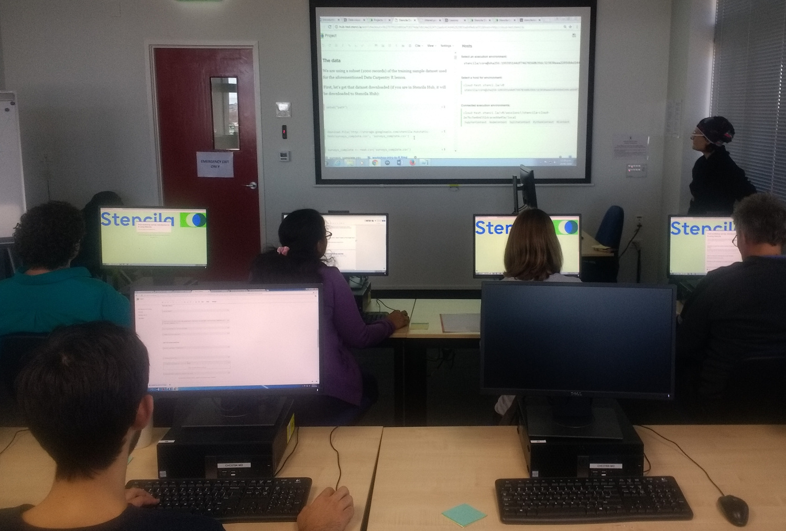
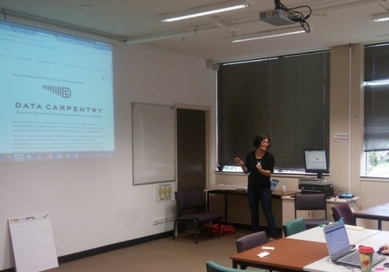

Between end of June and beginning of August 2018 we ran 4 hands-on workshops to collect feedback from researchers trying out Stencila on real life tasks. In this blog post
we present the summary of the feedback we received and the lessons learned. It's been incredibly useful for us to get users' comments in this context. The workshop participants found a number of bugs (which was inevitable given that Stencila is still under development) and that in turn allowed us to improve our software as well as prioritize the next development steps.

{style="width: 60%; padding-right: 1em; float:left;" }

All workshops were run in a hands-on style. We used [Data Carpentry](https://datacarpentry.org/) and [Software Carpentry](https://software-carpentry.org/) materials
to teach introduction to data analysis and visualisation in Stencila. For all workshops we used an instance of the [Stencila Hub](https://github.com/stencila/hub). The reasons for that were two-fold. First, we wanted to make things easy for the participants and save them the overhead of setting up their machines (or the machines
in the computer lab at their organisation). Second, we wanted to test the Stencila Hub "in the wild" with a group of users simultaneously working on the infrastructure
and reporting the errors to us live. We scheduled the workshops so that we had about 2 weeks in between them in order to make improvements and fix the most
prominent bugs. (So the first group of users at the [Medical School at the University of Otago](https://stenci.la/blog/2018-07-02-workshop-otago-university) had to put up with the most issues; sorry!).

There were several themes emerging from the user feedback. Here are some of the most prominent ones.

### Everything in one place

The users really liked the ability to keep everything within one application: the data, the code and the text of the analysis.

> It's a nice way to keep all the code, outputs/graphs and notes about the data exploration and analysis in a single document. Amazing portability between file formats and ability to use (and change between) multiple programming languages. Fantastic reactivity (eg upload new spreadsheet to update the analysis).

For our workshops we used a sample dataset in `csv` format which allowed us to open it in a Stencila Sheet within the same project as the Stencila
Article containing the text and the interactive code cells. The ability to access both at the same time was much appreciated.

> Really nice interface for integrating and sharing data and documentation for a project.

### Collaboration

One of the Stencila goals is to facilitate easy collaboration and provide connection between research with different level of experience in programming. The feedback
we received shows that we are going the right direction.

> Seems intuitive and helpful for collaboration

The participants noted that Stencila "democratizes" reproducibility.

> It's also great that collaborators with different levels of skills can see what you have done and it is reproducible by anyone.

### One step to publishing

The easy ways of writing publications for Stencila was also appreciated.

> Could be a master tool for paper writing or lab data analysis

> I would like to see myself and my lab using this for everyday analysis of data and documentation of experiments, as well as writing theses and papers

We were particularily happy with this feedback given our collaboration with and the support we have received from
[eLife Sciences Publications](https://elifesciences.org/labs/c496b8bb/stencila-an-office-suite-for-reproducible-research).

### Visible visualisation

The users liked the combination of reactivity and visualisation features allowing them to immediately see the results of the code changes.

> The quick ability to see what the graphs will look like and then make small changes and see, quickly, how that impacts on the final graph

The reactive nature of Stencila was also an advantage for putting together a document in the environment similar to that of a word processor.

> I like that unlike R markdown documents it runs as you enter code rather than at the end when you knit it all together, easier to see what the finished document will look like and knowing that it works.

### Comfort of WYSIWYG

Many workshop participants, whilst being experts in their respective research domains, had limited experience in programming and working in environments
typical for code development, as well as using tools such as Markdown. However, the Stencila interface resembling of a text-editor and a spreadsheet-application
made them feel at ease.

> The interface is good and I like being able to work in an environment that looks familiar.

> I liked the display of the text and the graphs. It was clear and better than other programs like Rstudio

> I haven't used R before but I didn't feel freaked out by the interface. I like how the data sits alongside the document being edited.

 <em>Photo: Dr Arindam Basu</em>

The positive feedback has been a great boost for us and reassured us that Stencila is going the right direction. But there are still many things to improve and fix.

### Reliability

The Stencila Hub (where the projects documents live) and Stencila Cloud (where the code is actually executed) had their actual premiere during the workshops. It gave us an excellent opportunity to test their
reliability and robustness. Indeed we caught many bugs (many thanks to all participants for their understanding and patience!). There have been issues with
the stability of the connection between the Hub and the Cloud resulting in some session being terminated which would show to the users as inactive code cells.
The configuration of the Kubernetes Engine running Docker containers for the execution contexts also needed some tweaking.

### Saving

Yes, you read that right: we need to improve the _saving_ feature in the Hub. It seems like the most basic thing to implement and enable but the Stencila Hub
enables quite sophisticated saving and versioning ability which makes things a bit more complicated from the backend. Nevertheless, we are working on
making sure that the users can rest reassured that all their work will be saved (and autosaved, too!) and they will be able easily browse through the history of
changes.

### Better interfaces

Working with four groups of users coming from different backgrounds clearly showed some of the shortcomings of the current interface and need for improvements.

> Optional way to hide outputs would be very useful. There is a lot of scrolling for longer datasets

> Putting a "+" icon under a cell for adding another cell.

> Not being able to set a default language for each code box on the Hub

Whilst the workshop participants appreciated the Stencila Sheets, this interface still requires a lot of work to make it friendly for spreadsheet users and at the
same time retaining the feature to leverage the power of using programming languages, including domain-specific functions, for data analysis.

### Hub and Desktop

We asked the participants of all workshops if they would prefer, in the future, to work on the Stencila Hub, Stencila Desktop, or use both interchangeably. The vast majority (18) of the attendees said they would like to use both. Only a few were interested in using exclusively either the local instance (Stencila Desktop) or the Hub. It is a clear indication we need to work on these two components in parallel.

# Thank you!{style="text-align:center;"}

We are fueled with enthusiasm and motivation from people's kind word e.g.

> Overall I thought this was a really wonderful workshop. I think this tool is very useful and I look forward to using it in the future.

We are very grateful to all participants of the workshops for their feedback, patience and understanding:

- the [Medical School at the University of Otago](https://stenci.la/blog/2018-07-02-workshop-otago-university);
- the [Bioluminescent Superbugs Lab at the University of Auckland](https://stenci.la/blog/2018-07-20-workshop-superbugs/);
- the [University of Canterbury](https://stenci.la/blog/2018-07-uni-canterbury/);
- [SIGNAL ITC Grad School](https://stenci.la/blog/2018-08-signal/).

and everyone who helped organise these events.
