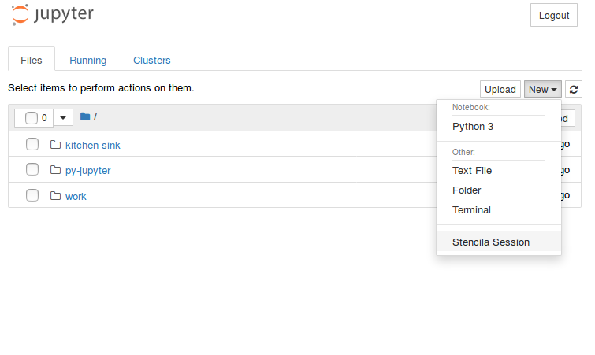
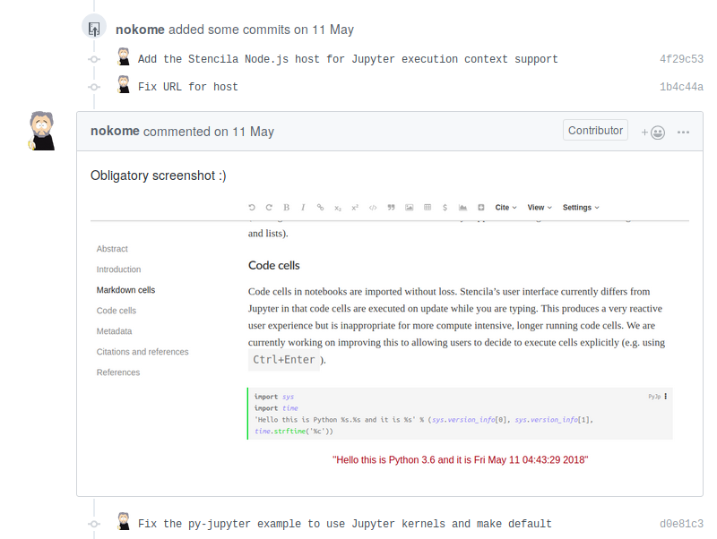
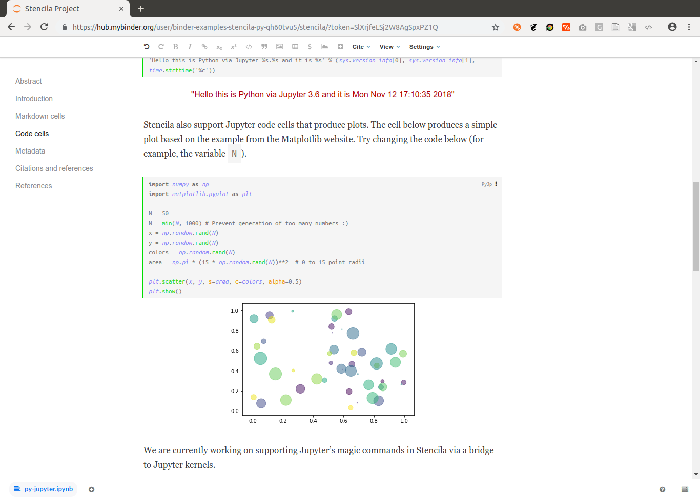
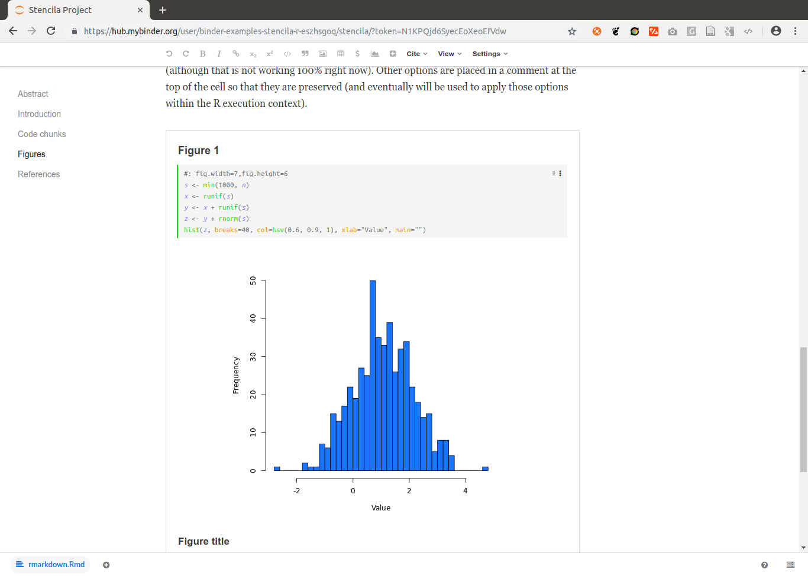

_This article reports on a project, integrating Stencila and Binder, which started at the eLife Innovation Sprint 2018. It has been cross-posted on multiple blogs such as [eLife Labs](https://elifesciences.org/labs/d42fe2b9/integrating-binder-and-stencila-the-building-blocks-to-increased-open-communication-and-transparency). We welcome comments and feedback on any of them!_

[eLife](https://elifesciences.org/), an open science journal published by the non-profit organisation eLife Sciences Publications from the UK, hosted the first [eLife Innovation Sprint 2018](https://elifesciences.org/labs/bdd4c9aa/elife-innovation-sprint-2018-project-roundup) as part of their [Innovation Initiative](https://elifesciences.org/about/innovation) in Cambridge, UK:
_"[..] a two-day gathering of 62 researchers, designers, developers, technologists, science communicators and more, with the goal of developing prototypes of innovations that bring cutting-edge technology to open research communication."_
One of the [13](https://elifesciences.org/labs/bdd4c9aa/elife-innovation-sprint-2018-project-roundup) projects at the [excellently organised event](https://elifesciences.org/inside-elife/b4ed92e1/innovation-collaboration-and-creativity-at-the-heart-of-the-elife-innovation-sprint-2018) was an **integration of [Binder](https://mybinder.readthedocs.io/) and [Stencila](https://stenci.la/)**.

This article reports on the project's inception, building blocks, achievements at the sprint weekend, and work conducted in the months following the sprint.
**Today, Binder has first class Stencila support.**
You can open Stencila documents from any online code repository on [mybinder.org](https://mybinder.org/) with the click of a single button. Just try out the example below:

[{style="width: 30%; padding-right: 1em; float:center;" }](https://mybinder.org/v2/gh/binder-examples/stencila-py/master?urlpath=stencila)

## The idea and the sprint team

The eLife Innovation Sprint started with brief [introductions by all participants](https://docs.google.com/presentation/d/1gvyoGW-__7k41KFN4PLhZtpapHNr-4IoeMTIXMiFHDs/edit#).
Some of them prepared pitches for projects ideas, which quickly got little group discussions going.
One table at the sprint attracted a few people with an interest in [containerisation technology](https://en.wikipedia.org/wiki/Operating-system-level_virtualization) for research applications.
Many ideas were floated and a helpful exchange around existing solutions and tools took place.
When it was time to find a concrete task, two of the sprinters identified a worthwhile technological problem as their challenge for the next 1.5 days and the project "Jupyter+DAR compatibility exploration" started.
[Min](https://github.com/minrk) from the [Simula Research Laboratory](https://www.simula.no/people/benjaminrk), Norway, is a core developer of [Binder](https://mybinder.readthedocs.io/en/latest/) and related tools.
He was interested to get to know the Stencila project and explore the possibilities of having alternative user interfaces on Jupyter Hub.
[Daniel](https://github.com/nuest) from the [o2r](https://o2r.info) project at the [Institute for Geoinformatics](https://www.uni-muenster.de/Geoinformatics/), Germany, works on reproducible computations in the geosciences and had a keen interest in learning more about the Binder platform.
They were joined remotely by [Nokome](https://github.com/nokome), the initiator and one of the developers of Stencila.

## The building blocks

**Stencila Desktop** is an [office suite for reproducible research documents](https://elifesciences.org/labs/c496b8bb/stencila-an-office-suite-for-reproducible-research).
It allows scientists to use languages like R and Python within familiar and intuitive word processor and spreadsheet user interfaces.
By doing so, it aims to lower the barriers to reproducible research for those with little or no software development skills.
At the same time, Stencila aims to make it easy for researchers versed in software development to collaborate with their colleagues without having to switch from R or Python.
Stencila Desktop is built upon [Texture](https://github.com/substance/texture/), an editor for scientific content, which uses the [Dar](https://github.com/substance/dar) file format. Dar is an extension of the JATS publishing format which has been designed for [reproducible research publications](https://elifesciences.org/labs/7dbeb390/reproducible-document-stack-supporting-the-next-generation-research-article). It aims to serve researchers using computational methods for data, and publishers using digital workflows for publication and preservation of scholarly journals.

**Binder** makes it simple to generate reproducible computing environments from code repositories.
The online service [mybinder.org](https://mybinder.org/) is he most prominent example for a platform based on the Binder project, a part of [Project Jupyter](https://jupyter.org/).
A user can run a [Jupyter Notebook](https://en.wikipedia.org/wiki/Project_Jupyter#Jupyter_Notebook) and other environments for their research projects, which are published in online repositories (e.g. GitHub or GitLab, see [binder examples](https://github.com/binder-examples/)).
In the [spirit of the Unix philosophy](https://en.wikipedia.org/wiki/Unix_philosophy), Binder combines several Open Source tools to achieve this goal: [repo2docker](https://repo2docker.readthedocs.io/), for generating `Dockerfile`s and building Docker images from a software projects, [JupyterHub](https://z2jh.jupyter.org/) for executing a Docker image and user-facing web portal in a cloud environment, and [BinderHub](https://binderhub.readthedocs.org/) for gluing the above together.

A **`Dockerfile`** is a human- and machine-readable recipe for setting up a computational environment, which is just fancy words for saying "installing and configuring software".
`Dockerfile`s are used by the popular [Docker](<https://en.wikipedia.org/wiki/Docker_(software)>) container software.
They can be built into an executable image, which is portable between host computers.
These properties make containers [very interesting](https://duckduckgo.com/?q=docker+reproducible+research) for capturing and sharing research involving data and software.

While containers have become a commodity for developers, researchers still struggle to grasp and control the complexity of computational environments.
This is where the two building blocks join:
**Running Stencila as part of a Binder helps researchers to communicate their work openly, to collaborate effectively with other scientists, and to ensure a high quality and transparency of their workflow and findings.**

## The challenge

As Min and Daniel [formulated their goals in the sprint project form](https://docs.google.com/document/d/1WPMY-Al7WMdjlepKvvLiIxFrQPHFbADMNuwszs8xMHk/edit), the project was heavy with software titles:

_"Compatibility between Jupyter Notebooks / Binder and DAR / Texture / Stencila_

Their goal was _"[..] to connect them so that users can edit reproducible documents (DAR files) as part of a Binder project"_ with the following objectives: (i) understanding DAR [Dar Format], (ii) launching Stencila Editor on Binder (potentially not launching anything else, i.e. w/o the Jupyter Notebook start page), and (iii) repo2docker support for DAR files.
The project was also part of the [Mozilla Global Sprint 2018](https://mozilla.github.io/global-sprint/), see [mozilla/global-sprint#317](https://github.com/mozilla/global-sprint/issues/317).

## The solution

It took more than just the 1.5 days in Cambridge to really fulfil this challenge.
First we describe the crucial breakthroughs that were actually made at the sprint, then the updates that happened until today.

### Sprint breakthrough

Min and Daniel started by taking a close look at an existing solution, namely the integration of RStudio based on [`nbrsessionproxy`](https://github.com/jupyterhub/nbrsessionproxy), i.e. the "Notebook R session proxy".
They learned two things:

1. a Jupyter notebook extension can be used to add a menu item to the Jupyter UI
2. a component is needed to route the traffic between the browser-based user interface and the server-side software

The first attempts utilised Binder's feature of manually defining a bespoke `Dockerfile` (see [a first attempt](https://github.com/minrk/nbstencilaproxy/commit/535900a934685bcfaf940956ba2571dddbb19009)) and later also a [`postBuild` script](https://repo2docker.readthedocs.io/en/latest/config_files.html#postbuild-run-code-after-installing-the-environment) to install and configure all software.
It was Daniel's first task to transfer the first finding for Stencila.
After setting up a local development environment and learning Jupyter/Binder, it just needed small adjustments to selected files from `nbrsessionproxy` to achieve this (see [commit](https://github.com/minrk/nbstencilaproxy/commit/8e8f3676cd6b4616c4b5cd1bca7a40c6fe399613) from the second day):

Min took on the second task while at the same time figuring out what parts of Stencila we really needed, and how to glue them together.
He wrote a hard-wired proxy using [Python](https://github.com/minrk/nbstencilaproxy/commit/af8749b96188d0caada80cc3c35fdae9c53de613) and added some [JavaScript/HTML files](https://github.com/minrk/nbstencilaproxy/commit/0bcbf63a6f47b5f67aace7f15d7bce89c9eff6d3) to serve Dar files and the Stencila UI itself.

#### Connecting Stencila to Jupyter kernels

Stencila has "execution contexts" (the equivalent of Jupyter's "kernels") for R, Python, SQL, Javascript (in the browser), and Node.js. Execution contexts differ from kernels in a number of ways including code dependency analysis and returning execution results as data values. Both of these are necessary for the reactive, functional execution model of Stencila.

We could install these execution contexts in the Docker image.
However, Stencila also has a `JupyterContext` which acts as a bridge between Stencila's API and Jupyter kernels.
So, since the base `jupyter/minimal-notebook` image already has a Jupyter kernel for Python installed, we decided to use that.
This did mean however, that some of the reactive aspects of the Stencila UI won't work as expected.

We included the [`stencila-node`](https://www.npmjs.com/package/stencila-node) Node.js package in the Docker image which provides the `JupyterContext` as well as a `NodeContext` (for executing Javascript) and a `SqliteContext` (for executing SQL) .

We first used Stencila's development build to run the JavaScript app using `node make -w -s -d /our/own/dir`, but struggled a bit to configure the file storage, i.e. the `dar-server`, to use the directory we want to, and to run it in a full path configured by us instead of `make.js` starting the `dar-server` relative to `__dirname`.
_Eventually_ we ended up implementing our own minimal JavaScript module (i.e. an [npm](<(https://npmjs.com/)>) package) that run (i) the `dar-server` and (ii) a static file server for the app using the distribution files (i.e. the `dist` directory).
This gave us control of the paths and let us get rid of complex development features (e.g. `substance-bundler`).

We also made our own version of `app.js`, removing the virtual file storage (`vfs`, used to seamlessly integrate examples) and instead defaulting to a file system (`fs`) storage, because that is what is needed for Jupyter.
In the same line, we built or own `index.html` (based on `example.html`) to serve as the entry page.
This allowed us to directly render a single Dar document instead of a listing of examples and to use our own `app.js`.
Relevant path configurations comprised the local storage path _as well as_ the URLs used by the client, accessing the `dar-server` through the `nbserverproxy`.

**At the end of the first day**, the wiring was all there so we could open a repository and the Stencila document was shown!
But the interactive execution of code cells did not work yet :-/.

Thanks to an international time-zone-difference-powered "overnight" contribution, Min and Daniel got a big surprise on Friday morning:
Nokome [added the Stencila Node.js host for Jupyter execution context support](https://github.com/minrk/nbstencilaproxy/pull/5), so that Python cells could be executed by connecting to the Jupyter Kernel (which of course was already there in the container).
In doing so, he returned the "surprise" he had [when learning about the project](https://community.stenci.la/t/stencila-in-binder/142).
The added "host" provides the single gateway for code cell contents to be forwarded to the respective execution contexts.
Nokome showed everything works with the obligatory screenshot:

Since you can run any commit in a Binder, you can also try out that particular state [from the repository](https://github.com/minrk/nbstencilaproxy/tree/d0df78cb4c37b53fd90088db8e36531a813898c1) yourself:

[{style="width: 30%; padding-right: 1em; float:center;" }](https://mybinder.org/v2/gh/minrk/nbstencilaproxy/d0df78cb4c37b53fd90088db8e36531a813898c1?urlpath=%2Fstencila%2F)

**The second day of the sprint** involved many iterations of improvements, including changes to `repo2docker`.
These updates could not simply be thrown upon mybinder.org, so Min set up a test server for the demonstrations at the sprint's final day.
Daniel continued his work on supporting R code cells, but albeit [small contributions](https://github.com/stencila/r/pull/22) to the Stencila codebase, he could not complete this task in time.

The sprint ended with [presentations by all projects](https://bit.ly/sprint-time-to-shine), some of which are still continuing today, for example [Appstract](https://appstract.pub/), [Citation Gecko](http://citationgecko.com/), [PREreview](https://www.prereview.org/), or [Octopus](http://sciencepublishing.online/).
The results were truly awesome, ranging from ambitious concepts, case studies, design concepts, completely new tools with great UX design, to technical demonstrators.
It's an easy guess where on the spectrum our project can be placed...
You're invited to catch a glimpse of the sprint, its results, and the people behind all of it on Twitter under the hashtag [`#eLifeSprint`](https://twitter.com/hashtag/eLifeSprint?src=hash) and read the [project roundup](https://elifesciences.org/labs/bdd4c9aa/elife-innovation-sprint-2018-project-roundup).

The following screencast and Binder link show the **status at the end of the sprint**: a Stencila document could be opened on a bespoke Binder deployment and the contained Python code could be interactively edited.
The code is re-run on the server and the figure updated.

[[Watch video on YouTube](https://www.youtube.com/watch?v=nK27j5DA5k0)]

[{style="width: 30%; padding-right: 1em; float:center;" }](https://mybinder.org/v2/gh/minrk/nbstencilaproxy/d3271fe66951f15caf30a0cd90ca9dce9f626921)

<!-- <iframe width="560" height="315" src="https://www.youtube.com/embed/nK27j5DA5k0" frameborder="0" allow="accelerometer; autoplay; encrypted-media; gyroscope; picture-in-picture" allowfullscreen></iframe> -->

You can view the Python example document by appending `?archive=py-jupyter` to the URL of Stencila in the Binder, e.g. `https://hub.mybinder.org/.../stencila/?archive=py-jupyter`.

### Consolidation

A couple of weeks after the sprint, a second less intensive development period started. Daniel continued his work on adding support for the R context, and also managed to get plain Python cells running (see pull requests [#15](https://github.com/minrk/nbstencilaproxy/pull/15) and [#16](https://github.com/minrk/nbstencilaproxy/pull/16)).
Min restructured the whole project and gave it the name it still bears: `nbstencilaproxy` - a Jupyter notebook server extension and proxy for Stencila.

The projects GitHub repository holds a **Python module** with the Jupyter notebook server and "non-server" extensions of the same name, and a [bundled](https://github.com/minrk/nbstencilaproxy/commit/93dabbd890397aaad0d8efb316f7e1f2129e52f3) **JavaScript module** (of the same name).

The Python module allows proper versioned installation, dependency management, and installation from an established software repository.
It takes care of the plumbing between the user interface and the services in the background, so that the binder is viewable over one port in the browser, while the many different background components run on their own ports.
The "no server" extension adds the "Stencila session" menu entry and conveniently lives in the same directory structure as the server extension.

The JavaScript module manages the required JavaScript dependencies and provides an well-defined structure for the code files.
It serves the Dar document and provides access to the Stencila host (see above).

While complex at first sight, this modularity hopefully makes maintenance for future developments and new collaborators easier.
For now, the JavaScript module and its installation are bundled with the Python module instead of being published independently, because the code and configuration is very much specific to the Jupyter integration.

Min also extended `repo2docker` with [automatic detection of Dar documents](https://github.com/jupyter/repo2docker/pull/309/commits/eaa29ef3343442419df8cdd022f3e91ae9262926) (as part of a "build pack"), so that no configuration is required for most common use cases.
As with most Binder repositories, a user could simply open a Dar document on Binder and trust the required environment to provide all required software.

On July 20th the `nbstencilaproxy` [was published on PyPI](https://pypi.org/project/nbstencilaproxy/#history) and on August 1st, the new developments [made it into `repo2docker`](https://github.com/jupyter/repo2docker/pull/309).
Soon after Stencila was available for all users on mybinder.org, which was a great achievement for a little project started at a community sprint.
However, the big announcement was still not made, since some things were still hard-wired and, for example, to use R, the author of a repository [had to manually add a configuration file](https://repo2docker.readthedocs.io/en/latest/config_files.html) although the information that R is needed is already part of the Stencila document.

### The last mile

In October, Daniel took on the final tasks of writing this blog post and fixing the R installation, including the automatic detection of the required execution contexts of a given Dar document.
This included some [housekeeping](https://github.com/minrk/nbstencilaproxy/pull/18) in `nbstencilaproxy` and more importantly new [contributions to `repo2docker`](https://github.com/jupyter/repo2docker/pull/457) (thanks to [Tim](https://github.com/betatim) for review and help) to (i) properly detect the languages used in a Stencila document, (ii) extend the R build pack to install R if it is used in a Stencila document, and (iii) add documentation and tests.
`repo2docker` now detects Dar documents based on their `manifest.xml` files and uses the location of the first discovered one as the base directory to start Stencila.
If a Dar manifest is found, then `nbstencilaproxy` is installed and the languages are extracted from code cells from the document.
Authors can install extra dependencies using the [repo2docker's existing mechanisms](https://repo2docker.readthedocs.io/en/latest/config_files.html).

Daniel also created a few **example repositories** to provide a starting point for users.
Thankfully the binder team generously welcomed [the changes to mybinder.org]() and and the examples to the [binder examples organisation](https://github.com/binder-examples/) on GitHub.
The following repositories contain single or multiple Stencila documents with code chunks in different programming languages.

**[https://github.com/binder-examples/stencila-py](https://github.com/binder-examples/stencila-py)** contains Python code cells, using both the Jupyter and plain Python execution contexts:

[{style="width: 30%; padding-right: 1em; float:center;" }](https://mybinder.org/v2/gh/binder-examples/stencila-py/master?urlpath=stencila)

**[https://github.com/binder-examples/stencila-r](https://github.com/binder-examples/stencila-r)** contains R code cells and two plots:

[{style="width: 30%; padding-right: 1em; float:center;" }](https://mybinder.org/v2/gh/binder-examples/stencila-r/master?urlpath=stencila)

**[https://github.com/binder-examples/stencila-multi](https://github.com/binder-examples/stencila-multi)** demonstrates how to access specific Dar projects if multiple are found within a repository.

[{style="width: 30%; padding-right: 1em; float:center;" }](https://mybinder.org/v2/gh/binder-examples/stencila-multi/master?urlpath=stencila)

In each case you can see the available execution environments by clicking on the icon in the bottom right corner.

One of the cool features of Stencila are the reactive cells, as demonstrated in a tweet following the feature release:

<blockquote class="twitter-tweet" data-lang="de">
Thanks to <a href="https://twitter.com/nordholmen?ref_src=twsrc%5Etfw">@nordholmen</a> working on <a href="https://twitter.com/stencila?ref_src=twsrc%5Etfw">@stencila</a> support for <a href="https://t.co/Zlj6FrYgBw">https://t.co/Zlj6FrYgBw</a> you now have reactive cells with Python code on <a href="https://twitter.com/mybinderteam?ref_src=twsrc%5Etfw">@mybinderteam</a>! Give it a go <a href="https://t.co/ToIuQPq0Fy">https://t.co/ToIuQPq0Fy</a> <a href="https://t.co/Wjyf1kiH9B">pic.twitter.com/Wjyf1kiH9B</a>
&mdash; Tim Head (@betatim) <a href="https://twitter.com/betatim/status/1062004432806785024?ref_src=twsrc%5Etfw">12. November 2018</a></blockquote>

## Summary and outlook

_Thanks for reading so far!_
This blog post is a [long planned](https://github.com/minrk/nbstencilaproxy/issues/12) write-up of the history of the tool and decisions mostly relevant to developers, but also an demonstration of the power that the Open Source and Open Science community can foster.
Many people are working together on the (technological) challenges of science today towards full research transparency and reproducibility, even if we use computers to an unprecedented level.
Many small contributions on "side projects" such as these can make a difference, and connecting these two great projects hopefully helps to solve some problem in science down the road.

_What's next?_
While there are no concrete plans, there are of course some ideas listed on the [project's issue tracker](https://github.com/minrk/nbstencilaproxy/issues/), such as an automatic Jupyter notebook to Dar conversion when there is no Dar archive in a repository.
In any case you can keep an eye out on GitHub for projects being [tagged `stencila` and `binder`](https://github.com/search?q=topic%3Abinder+topic%3Astencila+org&type=Repositories) and join the public [Stencila](https://gitter.im/stencila/stencila) and [binder](https://gitter.im/jupyterhub/binder) chats to stay in touch or get help.
We look forward to see scientists using `nbstencilaproxy` for communicating their work and new challenges that come with it.

<blockquote class="twitter-tweet" data-lang="de">
<a href="https://twitter.com/hashtag/eLifeSprint?src=hash&amp;ref_src=twsrc%5Etfw">#eLifeSprint</a>-ers <a href="https://twitter.com/minrk?ref_src=twsrc%5Etfw">@minrk</a> and <a href="https://twitter.com/nordholmen?ref_src=twsrc%5Etfw">@nordholmen</a> are working to connect <a href="https://twitter.com/hashtag/JupyterNotebooks?src=hash&amp;ref_src=twsrc%5Etfw">#JupyterNotebooks</a> / <a href="https://twitter.com/hashtag/Binder?src=hash&amp;ref_src=twsrc%5Etfw">#Binder</a> with DAR / <a href="https://twitter.com/hashtag/Texture?src=hash&amp;ref_src=twsrc%5Etfw">#Texture</a> / <a href="https://twitter.com/stencila?ref_src=twsrc%5Etfw">@Stencila</a>, so that users can edit reproducible documents as part of a Binder project <a href="https://t.co/2GoGNydsmX">https://t.co/2GoGNydsmX</a> (<a href="https://twitter.com/mybinderteam?ref_src=twsrc%5Etfw">@mybinderteam</a> <a href="https://twitter.com/ProjectJupyter?ref_src=twsrc%5Etfw">@ProjectJupyter</a> <a href="https://twitter.com/_substance?ref_src=twsrc%5Etfw">@_substance</a>) <a href="https://t.co/sZ8bbE9SsM">pic.twitter.com/sZ8bbE9SsM</a>
&mdash; eLife Innovation (@eLifeInnovation) <a href="https://twitter.com/eLifeInnovation/status/994583390895697920?ref_src=twsrc%5Etfw">10. Mai 2018</a></blockquote>

