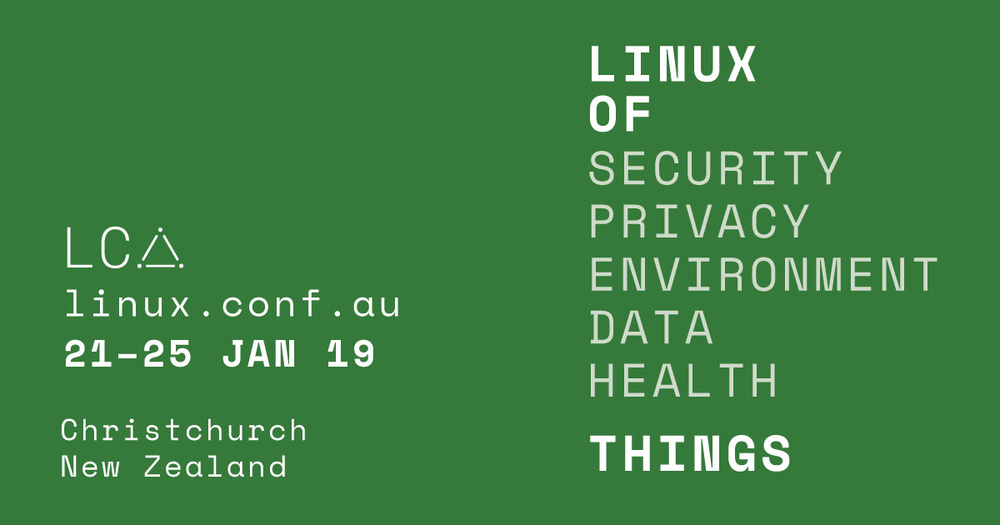

The end of January 2019 has been really busy for us. We attended the [2019 linux.conf.au](https://linux.conf.au/) conference which took place in Christchurch.
This years theme was Linux of Things and we run a Stencila tutorial on one of our recently developed components called
[_Dockter_](https://stencila.github.io/dockter/) for easing the process of building Docker images for reproducible research.
Our ["Building reproducible computing environments: a workshop for non-experts"](https://2019.linux.conf.au/schedule/presentation/185/) session was fully hands-on

{style="width: 80%;" }

We demonstrated the key features of Dockter such as:

- building a Docker image from the source code (we used one example in R and one in Python);
- analysing package information available on databases such as CRAN for R to determine system dependencies and including them in the Docker image;
- fast rebuilding of Docker images, thanks to the "thin" layer approach that Dockter implements.

These features have been also described in our article published by [the Opensource.com](https://opensource.com/article/19/1/dockter-image-builder-researchers) who was covering linux.con.au 2019. Opensource.com is a Red Hat-sponsored community publication that attracts more than 1-million unique visitors a month and publishes content under the CC BY-SA 4.0 license.

The whole [session was recorded](https://t.co/L9ZGQju6Ml). If you would like to follow the tutorial:

- make sure you have [Docker](https://docs.docker.com/install/) installed;
- install [Dockter](https://stencila.github.io/dockter/#install);
- download the [sample projects](https://tinyurl.com/dockter-tutorial);
- and please provide us feedback! Ether on our [Gitter chat](https://gitter.im/stencila/stencila) or [Community Forum](https://community.stenci.la/).
