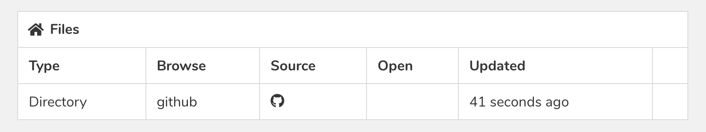
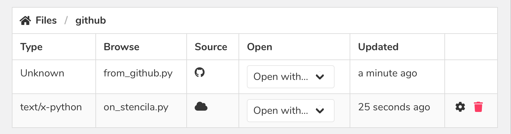

The Stencila Hub is the web application that allows users to easily use Stencila's tools for executable documents without having to install them on their own machine. In addition, the Hub allows users use to manage projects, accounts, teams, execution sessions and remote code and data sources. To support Stencila Hub's use in a Data Ethics course at the University of Canterbury, we added a few new features and enhancements, which I will talk about in this post.

## Linked Sources

We have completely revamped how file sources work in Stencila Hub, allowing flexibility to how source and other files fit together, no matter where they come from.

For example, a directory can be mapped from a GitHub repository into your `Project`'s workspace. Then, you can create a file that is hosted inside the Stencila Hub but _appears_ to be inside the GitHub repository without actually being hosted on GitHub. These screenshots illustrate an example.



Here a GitHub repository has been mapped into the _github_ directory of the Project. Navigating inside we see two files.



- `from_github.py` - this is stored in GitHub
- `on_stencila.py` - this is stored in the Stencila Hub file storage

Either of these files can be edited with an essentially identical code editor (also new – we have now integrated [Monaco Editor](https://microsoft.github.io/monaco-editor/index.html)). The only difference is that editing the GitHub file allows the setting of a commit message when saving and automatically creates a commit back to GitHub.

On doing a `Project` pull, the files are cloned to the local disk and the "virtual" directory structure is mirrored as real files and directories on the file system:

```
$ ls
github
$ ls github
from_github.py on_stencila.py
$
```

Hub directories can also contain other linked sources, and sources can even be nested inside each other (including sources from different providers [although only GitHub is supported at present, we plan to integrate with DropBox and Google Drive soon]). All content can be edited through the Hub, and if your script generates new files on disk they will be browseable and editable through the Hub too.

## Project Archiving

One of the requirements of the Data Ethics course was to be able to archive a project at a point in time, so students were able to prove when a particular lab or assignment was completed. This is also a common use case for other educators.

Stencila Hub now has Project Archiving. This will create a zip archive of the entire `Project` file contents. First it pulls all the linked sources and combines with the files already on disk, and then zips up this folder. The zip archive name contains the date it was created so students are not able to fake this to pretend an assignment was completed earlier than it was. Optionally, students may add a tag which is prepended to the archive name to help identify it.

`Project` access rights (covered in more detail in the next section) are applied so only users who have access to the `Project` can download the Archive.

## Accounts, Teams, Project Permissions

Also new to the Stencila Hub is an enhanced, flexible permissions system.

- `Accounts` can have multiple `Users` assigned to them with different levels of permission.

- `Teams` can have multiple `Users`, and `Users` can be in any number of `Teams`. Access to `Projects` can be given on a `Team` or `User` basis.

- A `User`'s access is based on the highest level available – if a `User` itself has only read access but is in a `Team` with modify access the `User` will be able to modify the Project and its files.

All this additional flexibility is useful in an education environment. A `Team` can be created to contain all the students in a class and given read access to a reference `Project`, either before a lab or after its completion to be able to compare solutions.

A course instructor or tutor can be given read access to the studen't project in order to view archives to verify solutions, or write access to assist with code changes or data fixes.

## Conclusion

These are just a few of the changes that we've made to Stencila Hub in order to meet the needs of the University of Canterbury, other educational institutes, and the Stencila Community as a whole.

We're looking for beta testers of the Stencila Hub: you can find out more on our [Beta Testing Program Page](https://stenci.la/community/beta-testing.html). If you want to use Stencila to teach your students but it doesn't quite meet your needs yet, please [contact Stencila](mailto:hello@stenci.la) and we'll discuss what we can do to help.
