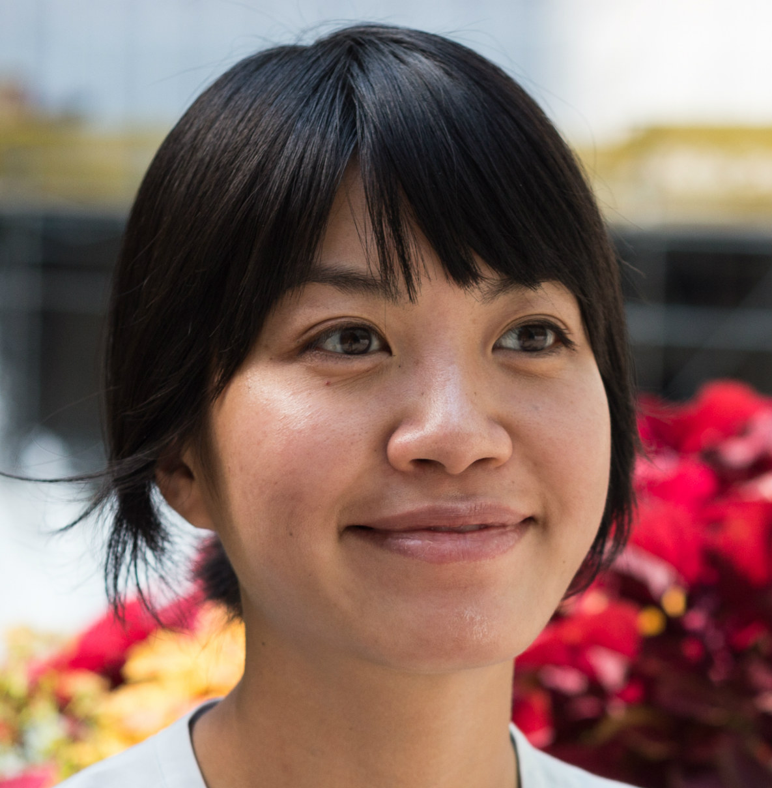

{style="display: inline; width: 40%; margin: 0 auto; padding-right: 1em; float: left;" }
Jacqueline joined Stencila in March 2019 as a Product Designer. Her background is in full-stack development. Previously, she worked for startups, consultancies, and large enterprise on various web, mobile applications and open-source enterprise tools. She has experience mentoring designers and developers, and aims to bridge the gap between coders and non-coders. She loves whiteboarding, synthesizing user research, developing sitemaps and task flows, and refactoring lines of code.

At Stencila Jacqueline is specifically interested in the task of developing open-source tools and growing a
community around them.

In her free time, she enjoys comics, cartoons, hiking, and yoga. Originally from from Hawaii/Indonesia Jacqueline is currently based in Seattle, Washington.

You can find Jacqueline at [Stencila Gitter Channel](https://gitter.im/stencila/stencila).
