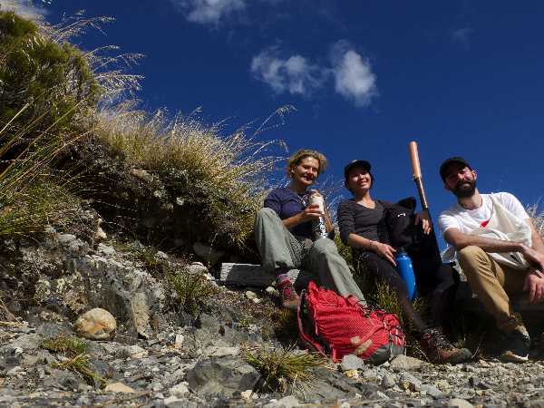
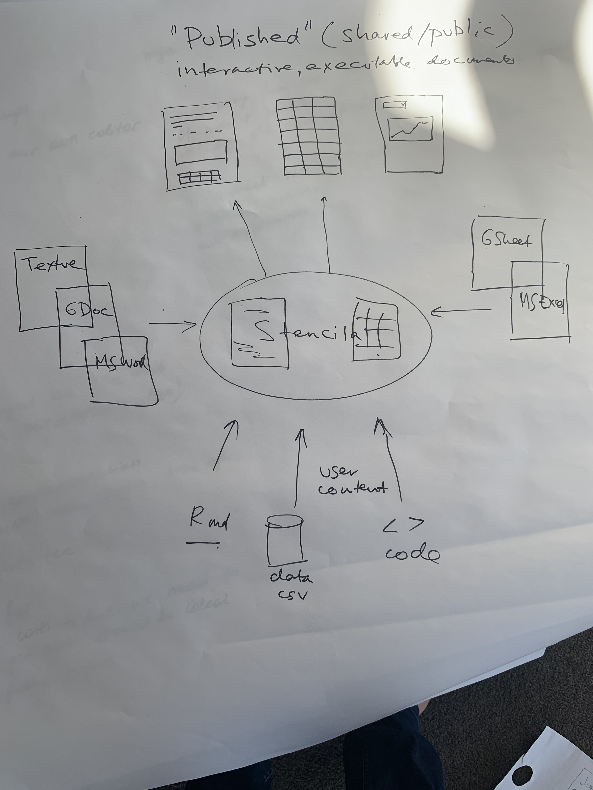
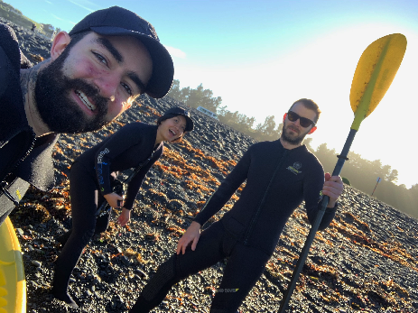
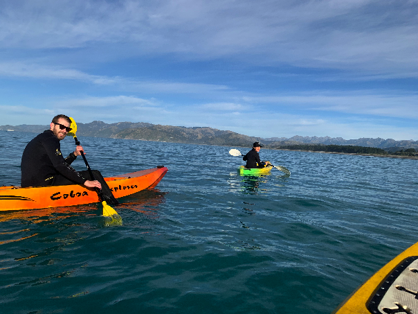

The Team Meet was an opportunity for the whole team to meet face-to-face. Jacqueline, who recently joined Stencila as the Product Designer and Alex, who is Stencila’s new Software Engineer travelled all the way down from North America to Auckland where we started our 2 week event. For the first few days we focused on planning and discussing our work over the upcoming months. We did a short sprint on [Stencila Schema](https://github.com/stencila/schema) building a good base for further refinement. Jacqueline and Alex met with Dr. Siouxie Wiles who hosted one of the first workshops [“Teaching R using Stencila”](https://stenci.la/community/events/2018-07-12-superbugs.html) last year at the University of Auckland. Siouxie and one of her postgraduate students provided us with a lot of useful feedback to help shape further development of Stencila.

The first week was an introduction to the delicacies of Kiwi cuisine for Jacqueline and Alex. Ben, Stencila’s Software Engineer, stepped in with his expert knowledge of the topic, making sure that the overseas guests would not miss out on specialities such as pineapple lumps and L&P. He however did not manage to deliver his signature dish, a roasted kiwi. Alas! There will always be next time.

After an intensive 5 days of work, we shifted to the South Island. The weekend helped us all to decompress and charge the batteries. Jacqueline, Alex and Aleksandra explored the Great Outdoors for a day doing some bouldering in Castle Hill and [tramping](https://en.wikipedia.org/wiki/Tramping_in_New_Zealand) in Arthur’s Pass.

We kicked off the second week with a day filled up with meetings with Stencila users who provided us with a lot of valuable feedback. We spent whole Monday at the University of Canterbury campus talking to students and tutors from the [The Trustworthy Data Scientist](<https://www.canterbury.ac.nz/courseinfo/GetCourseDetails.aspx?course=DATA471&occurrence=19S1(C)&year=2019>) course which uses Stencila Hub for its practical classes.

The rest of the week we spent working together in Kaikoura (where Stencila is originally from!). We focused further on the plans for the coming months, including:

- development of new Stencila components;
- refinement and implementation of Stencila Schema;
- incorporating user feedback into the design of Stencila components;
- strategies for community outreach and engagement;
- and much much more.

These were 2 very exciting weeks but perhaps the highlight was a very close encounter with friendly dusky dolphins! Each year for a very short period of about 2 weeks, pods of dolphins show up in Kaikoura’s South Bay.

Thanks to Nokome, Stencila’s founder, we were all able to get on kayaks on a Thursday morning and see these beautiful sea mammals from the close up.

Everyone in Stencila works remotely but we want to make sure that we keep these Team Meets a regular event helping us all maintain the great team atmosphere. Till next time!
