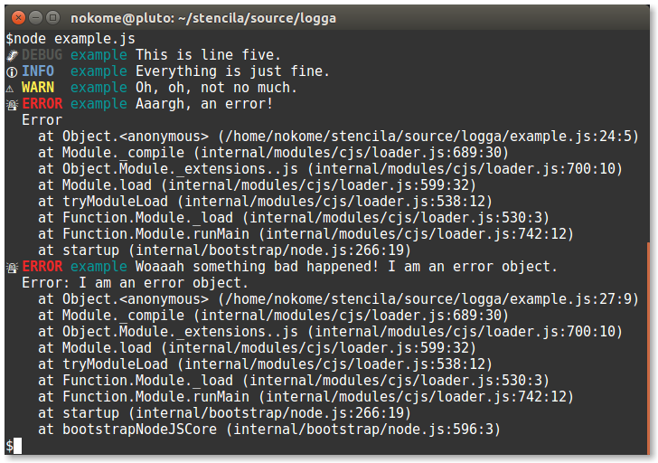

The next Stencila community call will take place on July 4th at 6am NZST ([see the time and date for your timezone](https://www.timeanddate.com/worldclock/fixedtime.html?msg=Stencila+Community+Call+July+2019&iso=20190704T06&p1=22&ah=1)). This call is open to everyone and we'd love to have you join us!

Ben will be showing us [Logga](https://github.com/stencila/logga) a new library for the under-appreciated art of logging 🌲. Alex will tell us about improving start-up performance in [Encoda](https://github.com/stencila/encoda) 🚗💨. Jacqueline will give us a preview of new designs for the Hub 🎨 and Nokome will update us on Encoda and Thema progress and roadmaps 📝.

Please [register](https://zoom.us/webinar/register/WN_mnVgZtNEQXezMtDtSz6VaA), and join the [Zoom conference](https://zoom.us/j/655391807) next week!

Looking forward to seeing you there!

