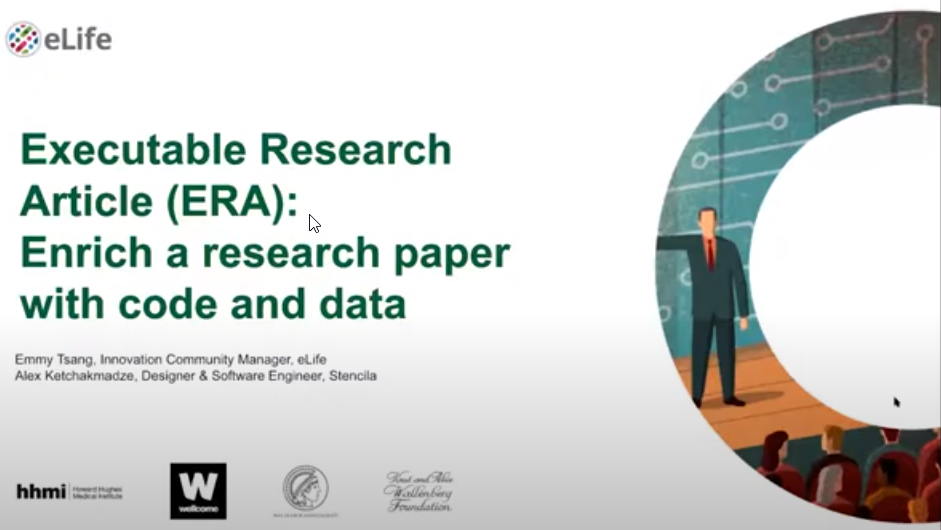

The option to create an [Executable Research Article (ERA)](https://elifesciences.org/labs/dc5acbde) is now available at eLife, taking published research to a new level of transparency, reproducibility and interactivity. Authors with a published eLife paper can register their interest to enhance their articles with live code blocks, programmatically-generated interactive figures, and dynamically generated in-line values.

This webinar includes a demonstration of the author workflow to create an ERA followed by a Q&A session where the attendees could directly ask the speakers their questions. 

Chaired by: Emmy Tsang – Innovation Community Manager, eLife 

Alex Ketchakmadze – Designer & Software Engineer, Stencila

[View the full recording](https://www.youtube.com/watch?v=wpFiky3ZGYM&feature=youtu.be).

