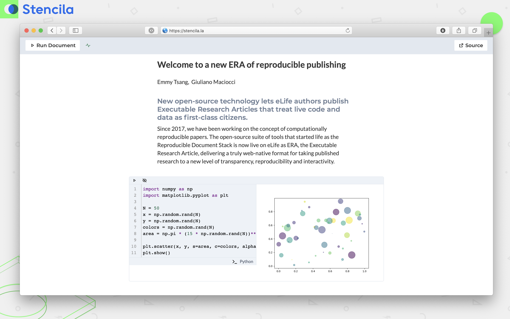

Today, in partnership with the scientific publisher eLife, we launched the Executable Research Article (ERA) project. ERAs allow authors to blend their traditional manuscript with live code, data, and interactive figures showcasing a new way for researchers to deliver their findings.

Authors can take a manuscript from formats such as Jupyter Notebook, RMarkdown, and Word to an easy-to-share web pre-print with customizable themes while retaining embedded code and its outputs.

Readers of these new ERA publications can then inspect the code, modify it, and re-execute it directly in the browser, enabling a better understanding of how a figure is generated. Change a plot, alter the data range of a specific analysis, and much more. Any changes are limited to an individual’s browsing session and do not affect the published article, so anyone can experiment safely. Readers can also download the ERA publication with all embedded code and data preserved and use it as a basis for further study or derivative works.

Stencila and eLife have been developing this technology together for over 2 years. Giuliano Maciocci, eLife Head of Product and Experience, explains our goals:

"ERA's goal is to elevate code and data to the same level as the narrative and figures of a traditional research article, and present them in ways that encourage readers to learn through direct interaction and experimentation. ERA also increased the transparency of published research, letting authors share, through interactive code, the precise methods in which they are using data to generate their figures. It all adds up to a beautiful, user-friendly, and semantically structured research artifact that moves the publishing of scientific discoveries closer to a more reproducible, web-native ideal."

## Examples

Explore the functionalities of two published ERA examples:

1. [“Replication Study: Transcriptional amplification in tumor cells with elevated c-Myc”](https://elifesciences.org/articles/30274) by Lewis et al., 2018 showcases executable figures, tables and in-line numbers.
2. [“Inter- and intra-animal variation in the integrative properties of stellate cells in the medial entorhinal cortex”](https://elifesciences.org/articles/52258/executable) by Pastoll et al. demonstrates a variety of executable plots.

Click the _Run Document_ button at the top of the article to start a compute session. The blue “eye” icons throughout the paper indicate code blocks. Click to reveal the underlying code, which you can then edit in place. Press the white “play” icon at the top of the code block to execute your new code and see its effects.

## Further reading

\- Read the full [eLife Lab article](https://elifesciences.org/labs/dc5acbde/welcome-to-a-new-era-of-reproducible-publishing) with further information & FAQ’s.

\- Authors with a published eLife paper can [express their interest](https://crm.elifesciences.org/crm/ERA-InterestForm) to create an ERA publication.

\- Check out our open source software upon which ERA is based: <https://github.com/stencila>
