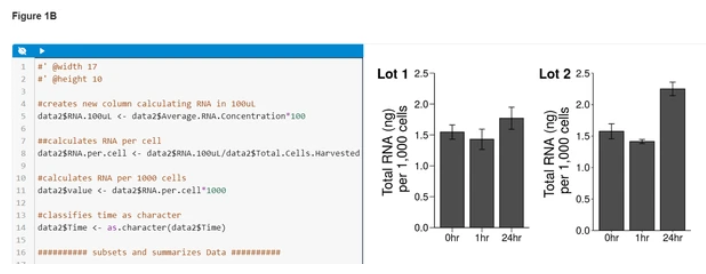

Since 2017, we have been working on the concept of computationally reproducible papers. The open-source suite of tools that started life as the [Reproducible Document Stack](https://elifesciences.org/labs/b521cf4d/reproducible-document-stack-towards-a-scalable-solution-for-reproducible-articles) is now live on eLife as ERA, the **Executable Research Article**, delivering a truly web-native format for taking published research to a new level of transparency, reproducibility and interactivity.

From today, authors with a published eLife paper can register their interest to enrich their published work with the addition of live code blocks, programmatically-generated interactive figures, and dynamically generated in-line values, using familiar tools like R Markdown and Jupyter in combination with Stencila Hub’s intuitive asset management and format conversion interface. The resulting new ERA publication will be presented as a complement to the original published paper. Very soon, a Google Docs plugin will also be made available to let authors insert executable code and data blocks into their documents using the cloud service.

Readers of ERA publications will be able to inspect the code, modify it, and re-execute it directly in the browser, enabling them to better understand how a figure is generated. They will be able to change a plot from one format to another, alter the data range of a specific analysis, and much more. All changes are limited to an individual’s browsing session and do not affect the published article, so anyone can experiment safely. Readers can also download the ERA publication – with all embedded code and data preserved – and use it as a basis for further study or derivative works.

Started by eLife in partnership with [Substance](https://substance.io/), and later developed by [Stencila](https://stenci.la/), ERA takes many of the important lessons learned from pioneering technologies like Jupyter and R Markdown, and folds them into a new open-source research publication format that treats code and data as first-class citizens alongside the traditional text and figures. The ERA technology stack is also designed specifically towards preprint and journal publishing, with strong XML standards, native [schema.org](https://schema.org/) compliance, and a versatile theming solution that makes it adaptable to the visual style of virtually any online publication.

### Getting started with ERA

Explore some of the functionalities that ERA offers with two published examples:

* [This ERA complement](https://elifesciences.org/articles/30274/executable) of Lewis et al., 2018 ([original article](https://elifesciences.org/articles/30274)) showcases executable figures, tables and in-line numbers.
* [This ERA complement](https://elifesciences.org/articles/52258/executable) of “Inter- and intra-animal variation in the integrative properties of stellate cells in the medial entorhinal cortex” by Pastoll et al. ([original article](https://elifesciences.org/articles/52258)) demonstrates a variety of executable plots.

Start by clicking the Run Document button at the top of the article. This will start a compute session. Be patient, as it may take a moment. When you see the “*Ready to run document*” message, you’re good to go.

Then, look for the blue “eye” icons throughout the paper, which indicate code blocks. Clicking on those icons will reveal the underlying code, which can then be edited in place.

After making an edit, press the white “play” icon at the top of the code block to execute your new code and see its effects. Please note that it may take some time for the code to execute, depending on its complexity and on server load.

[Read full article](https://elifesciences.org/labs/dc5acbde/welcome-to-a-new-era-of-reproducible-publishing) to find out **how to publish an article** with eLife and review **frequently asked questions**.