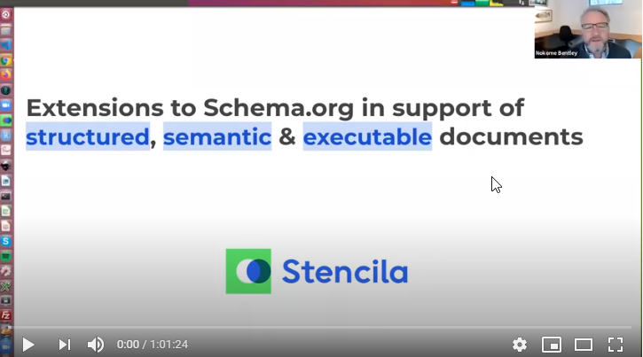

As we near a v1.0 release, we presented and asked for feedback on, the current state of Stencila Schema - [https://github.com/stencila/schema](https://www.youtube.com/redirect?q=https%3A%2F%2Fgithub.com%2Fstencila%2Fschema&event=video_description&v=DrsApxfUE6M&redir_token=QUFFLUhqa0VlZ2JERjhXdy16blNneGV1WkotM1pjMjNjUXxBQ3Jtc0trNmFuZ2ZDUFNpNjR1V0JOcHh3X1ZveXlBdjZvbEdEd29zeWVsQ0lOZ0x0NklhTnNSU1F6akJOWGZJZm1KMWhjNUNHN2JvRVJmTGMzWk1yQjVvSVRoRVo3ZHIxeFVMOTMtbE5VbGdfdlp2RFNGaEI2bw%3D%3D). For those not familiar, the project is a set of extensions for schema.org in support of structured, semantic, and executable research documents. 

Chaired by Nokome Bentley, CEO of Stencila 

Panelists: Thad Guidry, Arfon Smith, Vanessa Sochat, Dan Katz, Paul Shannon 

[View the recording](https://www.youtube.com/watch?v=DrsApxfUE6M)

Contribute to the [questions and suggestions](https://docs.google.com/document/d/1C0I-4ic0MLSPJR9xC58XColjOiUJDzdmUySzGu4Q2B4/edit#) from the panelists and attendees.

Useful links:

[https://schema.stenci.la/](https://www.youtube.com/redirect?q=https%3A%2F%2Fschema.stenci.la%2F&event=video_description&v=DrsApxfUE6M&redir_token=QUFFLUhqblJnNVB2Ym9kUFdTWXYtQVlsNDZwTTdKZ1dtd3xBQ3Jtc0tsZ0IzX0Qxb2lfQ1dlYUhNWW1vWFZMdWpqdGppVVZsT3MxMGRFakYwWmItcklnZElOb09JcjU3LUxYcG1JVjlwZkE1SmtkWnU2X180LXBiNlVaZ2xKZjlvT0ZlaFFHNjNEMHVqZVZQNE0wX3Qxb3Mwdw%3D%3D) 

[https://github.com/stencila/schema](https://www.youtube.com/redirect?q=https%3A%2F%2Fgithub.com%2Fstencila%2Fschema&event=video_description&v=DrsApxfUE6M&redir_token=QUFFLUhqa0JBR2hTaURpOWpGTVM4WWVRLWgwbWczZkdXd3xBQ3Jtc0trdWtWV3FHb3QwMEVDNnZkT0FETlF6NTFBTWIyRi1FaHp4LTZYbG5pclRkcWtrRk9UWTBPcDNCMHJ2TXE3TlZ4dHJXWEUybjJ5Tl9NNDE2SjJHQllsREpjRXNiZ0RQWEVremYyeWRiSEVLMkVTelFlNA%3D%3D) 

[https://schema.org/](https://www.youtube.com/redirect?q=https%3A%2F%2Fschema.org%2F&event=video_description&v=DrsApxfUE6M&redir_token=QUFFLUhqbWxVblVlNVlNTlVfbjNEenE4YVZWZ2o0S3NPQXxBQ3Jtc0ttUW1yRFNRVk0xZlU0NzNOZHZCX0ttbDBDWGg5NURtblpkaVY0a2xWSE1UNXc3cWJzSy1EaVVzdFhHcHpJZXJsNkZpZUVpTTFEOG9xM0NyYlgyNFFMbWQ5U1MtRnpLTE5xUVUzdFFGQ182MXVUYjM4Yw%3D%3D) 

[https://codemeta.github.io/](https://www.youtube.com/redirect?q=https%3A%2F%2Fcodemeta.github.io%2F&event=video_description&v=DrsApxfUE6M&redir_token=QUFFLUhqbVgxV2U2TkNvVGFMRHpIV1cxT0ZIRG13QndMQXxBQ3Jtc0tsbTRZc0d2cjZiZk5Ud3ZJTGNmbjRfdzFHTnp5VFpaX1htSml4QlRjZnRCRk1kVFBUbGkzamFfdlNCR0dqVjF0R0dfbFlfSUthSUlFODJuNnNGSVJTSHkwS05WRVBxSXd6NDMwR0pnNU5qNEVkSHA0VQ%3D%3D) 

[https://bioschemas.org/](https://www.youtube.com/redirect?q=https%3A%2F%2Fbioschemas.org%2F&event=video_description&v=DrsApxfUE6M&redir_token=QUFFLUhqbGsxeW94bkdIWmxwZktxWFhLdDlKZEI2aV9ad3xBQ3Jtc0ttR040b3pKQlI0RmFTTUJlUU5OWjVaZFVGSjNrU0dyeXZDWVBkNGRwdmQ1c2htRzQ0WUFrRkhBNUZSQnB2bXZMTVF4S0ZWMFNKMjktRVNxV1pQQ2xGTjZfTHI1VS1qdWVSWnZ5ZzlSd3VHVWpaV1NMTQ%3D%3D)