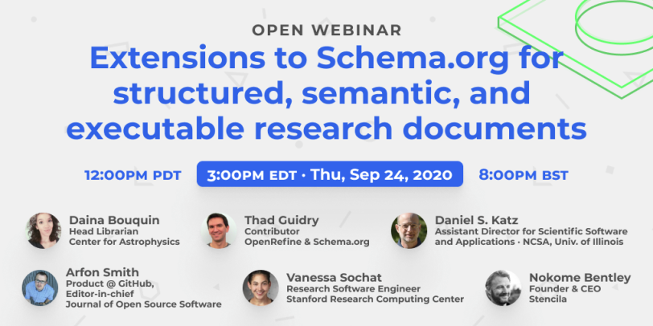

We’d like to get your feedback on the [Stencila Schema](https://stencila.intercom-clicks.com/via/e?ob=eege3L1TVsgHwx71fLee7Fzl68nhkkmANnFzNIZb4xeItv%2Bu%2FYuqZIwRNiq1TUDV&h=cf3bde05b187d2c6d640acd89ebbaf5095338d0b-y554dhej_12267800003451&l=aaec0c25b8a714dfdfb6efc513579bb1d5171d91-4552252), a set of extensions for [schema.org](https://stencila.intercom-clicks.com/via/e?ob=eAAAUdPcjTr28qS4PRGJNiF7a3URjZaEbHqTRm2a8SE%3D&h=5cf163ae4e8bc218e4f227c2785b78fe421008dc-y554dhej_12267800003451&l=6ad7b13a93dbc6258bcf8dd1237d9cb2ab4b3fce-4552253) in support of structured, semantic, and executable research documents. The Schema is at the core of much of our software and we're having this call ahead of a v1.0 release in the coming weeks.

**Thursday, September 24, 2020**\
12pm PDT · 3pm EDT · 8pm BST · 7am NZST (*September 25, 2020*)

This call is open to everyone and we’d love to have you join the conversation with our awesome panelists!

Join the [Zoom webinar](https://us02web.zoom.us/j/83174497222?pwd=R0F3ZDlTWDZZNHgvcG1lOUVhRi9pZz09) (Webinar ID: `831 7449 7222`).

Looking forward to seeing you there!
