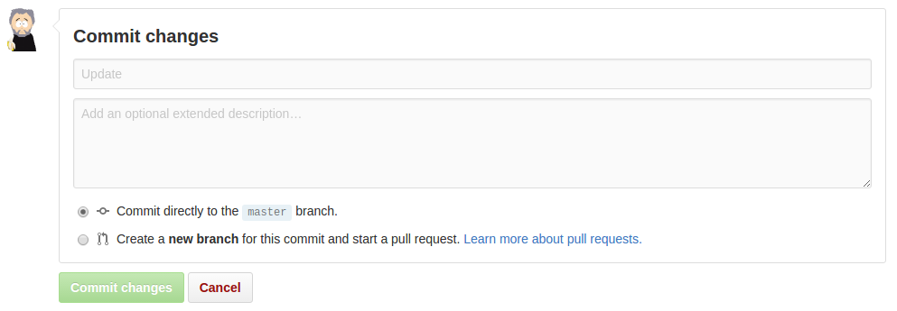

# It isn't easy being easy

I recently had a conversation about how difficult it can be to make things easy. Specifically, how do we make it easy for researchers to use tools for reproducible research?

Making software interfaces "user friendly", "frictionless" and with a low "cognitive load" has been a focus since before _software_ was a word. So why is it so difficult?

Well, maybe it isn't difficult. Maybe it just takes time. Time for us to develop the right abstractions, the right simplifications. Time for things to percolate up from the code-centric world of geeks into something the rest of us can digest.

Jeff Raskin, a pioneer of human-computer interactions noted that ["intuitive equals familiar"](http://www.asktog.com/papers/raskinintuit.html). To coders, code is intuitive; to everyone else, it's not. So when coders develop the Next Big Thing ™ they're pretty happy playing with it deep down in their codey world.

# Easy is getting easier

Fortunately, it doesn't take too long before non-code interfaces emerge at the surface. Take for example, [Git](https://git-scm.com/), the system for version control. It's possibly one of the most important pieces of software to have emerged in the last decade, and probably one of the [scariest to use](http://ohshitgit.com/). The most fundamental of all of Git's functions, is to create a "commit" (a checkpoint that, if need be, you can roll back to) and share it with your collaborators. Most coders will do that by writing some commands in a terminal console:

```
git add README.md
git commit -m "Update"
git push
```

That's pretty easy - if you're a coder familiar with the command line. But if your not, then it can be a little intimidating, and it's certainly not intuitive. So, to make using Git easier, companies like [Github](https://github.com/) and [Gitlab](https://about.gitlab.com/) have wrapped it in a "usability layer" - a translation between those code commands and something that, for most of us, is more familiar and requires less thought:



When you press that "Commit changes" button, exactly the same thing happens as when you enter those three lines at the console. And in both cases, working away in the background is a **lot** of code representing a **lot** of accumulated intellect, experimentation, experience and hard work. It is just one example of how really complicated computation can eventually get represented in easy to use interfaces.

It's also getting easier to create these easy interfaces. Open source frameworks like [React](https://facebook.github.io/react/) and [Polymer](https://www.polymer-project.org/1.0/) dramatically reduce the time and resources required to build them. Today, more than ever, building these interfaces is about putting these types of building blocks together the right way.

Easy is getting easier. But it still doesn't just happen. Instead, it has become less of a technical problem and more of a design problem. It now requires [less input from developers and more input from stakeholders](https://www.adamhyde.net/collaborative-product-design-v0-9-ch1-intro/). Getting users to design interfaces themselves (instead of creating hypothetical "user stories") can lead to greater understanding, familiarity, and thus intuitiveness, in the end product.

# Easy isn't enough

But of course, easy isn't enough. It's necessary, but not sufficient. To motivate a user to actually "use" - to click that button, type that command - there has to be an incentive. Indeed, the stronger the incentive, the less easy it has to be: people will overcome huge difficulties if the incentives are strong enough.

So, easy may be getting easier, but really, if we want scholarly communication that is open, transparent and reproducible, we also need to realign the incentives. Not only do we need ways of measuring those values (e.g. [#OAScore](http://blog.impactstory.org/whats-your-oascore/)), we need to realign incentives towards them.

At first thought, realigning incentives also seems like a difficult thing to do.

And then you look around. At the seismic shifts in social attitudes to sharing. At Facebook and Twitter. At the [growing anger](http://www.ascb.org/2016/11/07/on-publishing-and-the-sneetches-a-wake-up-call-november-december-2016-newsletter) at [monopolistic academic publishers](https://www.theguardian.com/technology/2012/apr/22/academic-publishing-monopoly-challenged). And then you think, realigning incentives might just be getting easier too!
