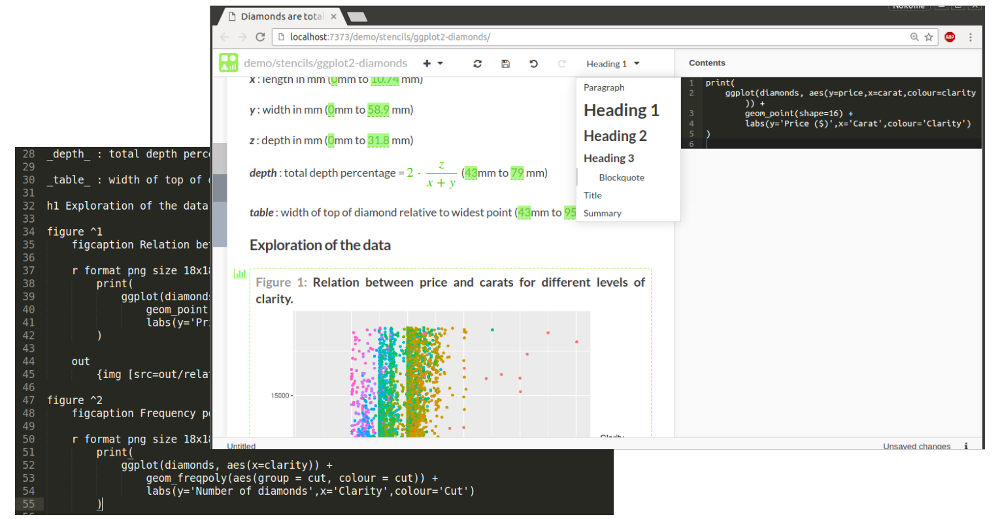
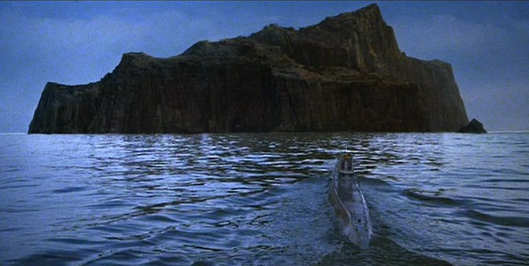

This is the first in a new series of posts providing updates on Stencila development. We'll be updating you on progress and plans every 1-2 weeks with a short video accompanying each post. But, to begin, some history...

# The story so far

I've been working on Stencila for more than four years. The project grew out of my own frustrations with the traditional copy-and-paste workflow for creating, and collaborating on, data-driven, scientific documents. There were already tools for reproducible documents, like Sweave and RMarkdown, but I wanted something that didn't require my collaborators and editors to dive into code. Something that allowed you to contribute to a document using familiar WYSIWYG interfaces (like Microsoft Word and Google Docs) - **or** use code if you preferred. Something that allowed for truly programmable documents - not just code chunks embedded in text.

I was inspired by the conciseness and flexibility of web templating languages like [Slim](http://slim-lang.com/) and [Pug](https://pugjs.org/language/iteration.html). I was excited by the potential of `contenteditiable` and the elegance of [Medium](http://medium.com). So, I set about designing and implementing Stencila.

Because I wanted to have a system that was able to be used with several languages (e.g. R, Python, Julia) I wrote the core in C++. That core could then be exposed via [FFI (Foreign function interfaces)](https://en.wikipedia.org/wiki/Foreign_function_interface) to host languages using libraries like [Rcpp](https://cran.r-project.org/web/packages/Rcpp/index.html) and [Boost Python](http://www.boost.org/doc/libs/1_62_0/libs/python/doc/html/index.html). The strategy was "one implementation, multiple wrappers".

A year ago, I stumbled upon the awesome [Substance](http://substance.io) library. Its creators, Michael and Oliver, have been enthusiastic and supportive collaborators since and have helped me put the WYSIWYG into WYSIWYG interfaces.

By the middle of this year, Stencila was getting close to what I imagined it might look like when I started out. I had implemented a new markup language for reproducible documents (called Cila), built a rendering engine which was "non-destructive" (thereby allowing for a document to both edited by humans and rendered against data by computers), wrapped those C++ implementations into packages for R, Python and Node.js, and with the help of Substance, developed a visual editor for reproducible documents.

But all was not well.

# Of islands, causeways and bridges

In [_Raiders of the Lost Ark_](https://en.wikipedia.org/wiki/Raiders_of_the_Lost_Ark), Indiana Jones finds himself on U-boat heading towards [Geheimhaven](http://indianajones.wikia.com/wiki/Geheimhaven), a barren, rocky island somewhere in the Agean Sea. It's a long way from anywhere, has steep rocky sides and doesn't have any apparent redeeming features. It is not until Indiana gets to the island that he discovers there is a sophisticated Nazi supply base tunneled into it.

In my enthusiasm to create a better platform for reproducible research I had created an island like Geheimhaven. If you swam over to my island, I'd be able to show you around, show you all the sophisticated things I had done. You would see how much better it was. But from the mainland it didn't look particularly appealing, and certainly not worth the swim!

I could show you our nice WYSIWYG interfaces and truly programmable documents. But from a distance they look pretty similar to what is already offered by established projects like Jupyter.

I could explain why I think Cila is a better markup language for reproducible documents. But people have already invested in learning RMarkdown and Latex; they don't want to invest additional time in learning another language.

But perhaps the biggest issue with my island was it's monolithic structure; it's steep, rocky sides. Although there are advantages to "implement once, wrap often", it creates a highly coupled architecture which can be difficult to penetrate. Many people used to higher level languages like R and Python are intimidated by C++ and it's complicated builds. As an open source project, Stencila wasn't a very friendly looking island.

So a few months ago I decided it was time to move to a more decoupled architecture. Instead of one code repository with a core C++ implementation, there is now an ecosystem of software packages with separate native R, Python, Javascript implementations. So if for example you're a R coder, the [Stencila R package](https://github.com/stencila/r) looks like an R package, not something with a whole lot of C++ dependencies. Instead of focusing on creating new, better document formats, we're making use of tools like [Pandoc](http://pandoc.org/) to make sure Stencila first integrates well with existing formats like RMarkdown, Latex and Word. See the [umbrella repository on Github](https://github.com/stencila/stencila#readme) for more.

So the former monolithic island has been broken into an archipelago. An archipelago of islands that are connected by causeways and bridges to each other (each of the Stencila packages acts as both a client and a server and can make use of capabilities of the others) and to the mainland (there is now much better integration with "mainstream" formats and tools).

, in Norway is a series of causeways and bridges which connect an archipelago of islands to the mainland](atlanterhavsveien.jpg)

# The future

There are some exciting side effects of the decoupling of the Stencila architecture.

By decoupling document rendering from the execution engines we are now able to have polyglot documents, documents that embed more than one language. For example, you could have a document that extracts data from a database using SQL, analyses the data using R and then displays it interactively using Javascript.

Decoupling also opens the door to distributed computing, for example, executing compute intensive code chunks on more powerful remote machine which are close to where your data resides.

More details on all of this in future development updates.
