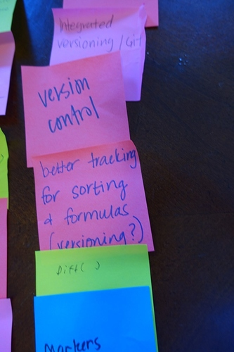

After five weeks of travel, including multiple user workshops, conferences and meetups we’ve been synthesizing all the ideas and feedback generated by the community. We held six workshops on features for Stencila Sheets (links at the end of this post). At each workshop we discussed the pros and cons of spreadsheets for research. We then asked participants to jot down on Post-it notes ideas for features that would make spreadsheets better for reproducible research.

{style="width: 600px;" }

Participants then split into groups, chose a “killer feature” from among their Post-it notes and collaboratively worked it up into a pitch to the other groups

{style="width: 600px;" }

This was a great way for us to get people ideas and priorities  **before** we demoed initial prototypes of Stencila Sheets. The community’s suggestions for features fall into 7 broad categories.

1. Data Entry and Integrity
2. Best Practices
3. Data Exploration
4. Version Control
5. Metadata
6. Integrations
7. User Interface

## 1. Data Entry and Integrity

Features in this category will help people reduce manual data entry errors, reduce autoformatting errors, and otherwise avoid corruption of data in a sheet. Strong typing, discussed [here](https://community.stenci.la/t/a-feature-list-for-stencila-sheets/57), is one form of data integrity check.

Features for the issue panel came up quite a lot. A few people even referenced our old friend from the ‘90s, Clippy! We don’t want to re-make Clippy (if you miss it [check this out](https://www.smore.com/clippy-js)), but creating a place for annotations, issues, and warnings is important. Currently, Stencila Sheets uses the issue panel to describe alerts, for example when a cell contains an incompatible data type.

To extend this, it was suggested that this panel could be used to create manual issues that link back to certain cell, as well as for suggestions, warnings, user generated directions (on a template, for example). We like this idea because many people use highlighting or text color to draw attention to areas of a spreadsheet. Additionally, researchers often set up template spreadsheets for data collection. With the option to create issues that link back to specific cells, rather than highlight data that need an annotation (examples: ”these data look suspicious”, “machine was not calibrated”), one could select the cells and create an issue to capture this without highlighting, bold, or red text in the sheet.

Adding testing to spreadsheets was another popular idea. Several participants suggested combining the the concepts of strong typing and tests. This would enable a user to make a custom data type and apply tests to it. For example, a `human_height` data type might be derived from the `number` type but have the additional tests that its value must be greater than zero and less than 3 metres.

The final feature suggestion in this category was type and function libraries. Many people expressed interest in a way to create shareable functions, tests, data types, and data transformations. A researcher who set up data parameters for a study would be able to share these with the Stencila community, and create or contribute to discipline specific libraries. Stay tuned here, we have some ideas brewing for 2018 on this topic.

## 2. Best Practices

Spreadsheets let users do anything, and typically this means that data, analysis, and visualization happen in the spreadsheet space. Spreadsheet users are used to the convenience of sending a spreadsheet that contains data, analysis and visualizations to collaborators. But mixing data with calculations and visualizations has [issues with it](https://community.stenci.la/t/a-feature-list-for-stencila-sheets/57/3). Separating data visualizations from data, perhaps by having outputs appear in an output pane based on Stencila Documents rather than in the Sheet is one approach to enforcing best practices. Preserving the ability to create a nice looking thing that can be shared, while encouraging best practices may come down to make explicit the time/place for workspace versus the time/place for outputs. In Stencila-land, we do this by encouraging Sheets for data and calculations, while pushing users towards Documents for presentation and sharing.

## 3. Data Exploration

Many participants requested features that would facilitate and even automate data exploration - in fact this category had one of the highest numbers of suggestions. This was expressed as an easy way to view summary data visualizations, automated suggestions for how to visualize data, and easy figure creating.

In a similar vein, the easy re-use of (and clear documentation and metadata on) data filtering and cleaning steps saves time and helps with onboarding students and collaborators. This could be established through development of function libraries, a user could create, save, reuse, and share their data filtering and cleaning steps.

## 4. Metadata

In order to be a user friendly as possible, while supporting useful human and machine readable metadata collection, our participants suggested that machine-readable metadata to be automatically generated with an option for manual human-readable annotation (data descriptions, data-readme). While there was no consensus on what the standard for this metadata should be - perhaps a metadata selection process when a file is saved would suggest standards to choose from?

## 5. Version Control

Everyone also wants version control. Google Sheets do snapshots, but what researchers want is the “diffs”. They want to see who changed what and when they changed it. Integration to Github, with user friendly git-based tools in the software were also popular feature suggestions. Somewhat surprisingly, there was more interest in versioning (seeing what changed when) than in real time collaboration (being able to edit a document at the same time as a collaborator).

{style="width: 400px;" }

## 6. Integrations

People were interested in the ability to generate Python/R from a Stencila spreadsheet. This can be thought of as a translator tool and a way to help spreadsheet users understand how programming languages take in data (eg: show me this in R/Python/SAS). Along the same lines, a code translation tool to convert functions into multiple languages was suggested

In terms of platform and tool integrations, there were no surprises here. Interfacing with Github, Image processing software, Juypter notebooks, easy connections to databases, Python, and R. Also, the ability to parse and edit XML, excel, and csv came up.

We are big fans of Juypter, R Studio, and other open source tools that support reproducible research. It’s important to us that Stencila works *with* the tools that people are using and helps to fill gaps.  For example, we want to make it easy for data collected by students in a Stencila Sheet to be analyzed in a Jupyter notebook or RStudio. When it’s time to write up a paper, Stencila Documents (which supports citations, authors and affiliations) could be the tool that takes a notebook to a manuscript, rather than Word. These integrations are a priority for us - stay tuned!

{style="width: 400px;" }

## 7. User Interface

Many suggestions for Stencila sheets UI surfaced. Among them are the following:

1. Writer - an interface for creating, viewing, saving, sharing, and editing functions, formulas, defining types, working with libraries, and creating workflows in Stencila.
- Maximum/Normal/Minimum view - An easy way to toggle between a normal view that hides formulas and a “maximum view” that Quick formula/function view. We already have this. We’ve also included a “minimum view” which looks nice to create reports for sharing with colleagues.
- Multiple tabs in one view - having regions of your spreadsheet that are typed and named, and reducing the flexibility of what you can do with those regions (ie, if you want to sum you must select the whole column - autoselection of a whole region)
- WYSIWYG (what you see is what you get) interfaces with accessible code underneath were suggested several times, and is something we are working on for Stencila Documents.
- Accessing tools more easily
- Help in the “issue” side panel
- Emoji support, character encoding, languages and non-english alphabets

{style="width: 400px; float:left; padding-right: 10px" }
{style="width: 400px; " }

# Thanks!

A huge thank you to all the people that attended the workshops. We really appreciate you taking the time to share your ideas with us. Don't hestiate to get in touch if you have ideas, use cases, or potential beta-testing scenarios to discuss! And extra special thanks to Miriam Posner (UCLA), Jamie Afflerbach (NCEAS), John Chodacki & Amy Neeser (UC Berkeley), Asia Mitchell (OHSU), Josh Greenberg (Sloan NYC), Jonathan Cain and Sarah Seymore (University of Oregon) for supporting our effort by organizing events in your cities.
