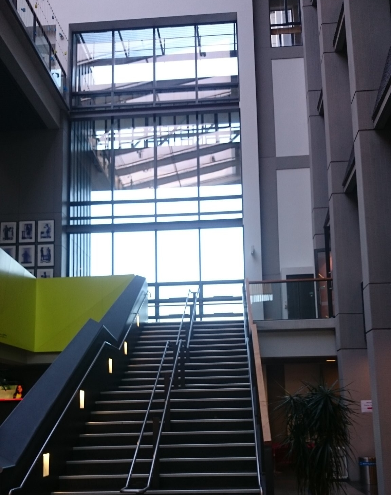

"Introduction to R using Stencila" with the [Bioluminescent Superbugs](http://www.superbugslab.org/) Lab at the University of Auckland was the second one after the workshop at the
[University of Otago Medical School](http://stenci.la/blog/2018-07-02-workshop-otago-university/). We again used the Stencila Hub which saved the participants
having to set up the machines as the Hub comes with all currently supported execution contexts and Stencila Article and Sheet interfaces.
The contents of the material was based on  [Data Carpentry R module for ecology](http://www.datacarpentry.org/R-ecology-lesson/) focusing on
 filtering and visualising data with the popular R package `tidyverse`.

{style="width: 40%; padding-right: 1em; float:left;" }

The Stencila Hub is still undergoing the development and so we encountered a few glitches during the workshop. We are incredibly grateful to the
participants for their patience and understanding. The Hub provides a lot of convenience in terms of easy setup but there are several improvements that
and bug fixes which require effort. [The Hub](https://github.com/stencila/hub) and the [Cloud](https://github.com/stencila/cloud), which just like all other Stencila components, are open-source uses Django and Kubernetes, so if you would like to help
just send a pull request!

Once again many thanks to all participants and to [Associate Professor Siouxsie Wiles](http://siouxsiew.blogspot.com/) who leads the Bioluminescent Superbugs Lab. The research group is
interested in trying out Stencila further on and using it for writing reproducible publications.
