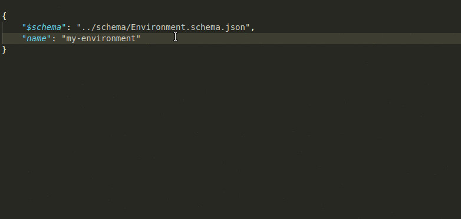

At Stencila, we're aiming to provide a framework for the next generation of executable documents. We envisage interactive spreadsheets, notebooks and articles that are highly structured (i.e. made up of a variety of fine grained document nodes) and strongly typed (i.e. only certain types of document nodes are allowed in certain places).

To achieve this we are representing executable documents as a tree of JSON data and using [JSON Schema](https://json-schema.org/) to specify and validate how that tree can be structured. This post briefly introduces some of the development approaches we've been finding useful in developing schemas for Stencila.

## Defining a schema

We plan to eventually define JSON Schemas for all the nodes that make up an executable document. However, currently we're focussing on the the "executable" nodes - those parts of the document that perform computation. This includes types like:

- `Package` a software package e.g. the R package `tidyverse` or the Python package `matplotlib`
- `Environment` a computational environment made up of `Packages`
- `Session` a run time process such as an R or Python session
- `Function` a function in some language with parameters, return type etc
- `Expression` a simple expression in some language
- `Chunk` a set of statements in some language

Although these are not the types of nodes you'd normally expect to see in a static document produced by, say, Word, they are necessary for a **reproducible**, executable document.

In this post, I'll be using, as an example, the schema that we are in the process of defining for `Environment` nodes. An executable document will probably only have one `Environment` node – to define which packages, and versions of those packages, are necessary to execute the document.

A JSON Schema is itself just a JSON document. The various properties of the JSON describe the schema providing both documentation and defining validation constraints. Below is the current draft of the `Environment` schema. This post is mostly about how we develop and use these schema so we won't go into more details here about it, but check out the json-schema.org site if you want to understand how to interpret this schema snippet.

```json
{
    "$id": "https://stencila.github.com/schema/01-draft/Environment.schema.json",
    "$schema": "https://json-schema.org/draft-07/schema",
    "title": "Environment",
    "description": "A computational environment.",
    "@id": "stencila:Environment",
    "type": "object",
    "properties": {
        "type": { 
            "description": "The type of document",
            "const": "Environment"
        },        
        "name": { 
            "description": "The name of the environment.",
            "@id": "schema:name",
            "allOf": [{ "$ref": "name.schema.json" }]
        },
        "description": { 
            "description": "Description of the environment.",
            "@id": "schema:description",
            "allOf": [{ "$ref": "#/definitions/description" }]
        },
        "extends": {
            "description": "Other environments that this environment extends by adding or removing packages.",
            "@id": "stencila:extends",
            "allOf": [{ "$ref": "#/definitions/environments" }]
        },
        "adds": {
            "description": "The packages that this environment adds to the base environments listed under `extends` (if any).",
            "@id": "stencila:adds",
            "allOf": [{ "$ref": "#/definitions/packages" }]
        },
```

You can use a online tool like [jsonschema.net](https://jsonschema.net/) or [extendsclass.com](https://extendsclass.com/json-schema-validator.html) to generate a JSON schema from a sample JSON document.

## Validating a schema

Having written, or made changes to, a schema definition, how do we check that it's correct? The answer is to use the schema's own `$schema` property:

```json
"$schema": "https://json-schema.org/draft-07/schema"
```

The `$schema` property gives the URL of the schema against which a JSON document should be validated. For a JSON-Schema document, its `$schema` is a "meta-schema" i.e. the schema for schemas.

Your favourite code editor may already be smart enough to detect the `$schema` property and warn you of any issues. Here, my editor, VS Code, is warning me that I've put a number instead of a string for my schema's title:


In addition, the [`stencila/schema`](https://github.com/stencila/schema) repository has got a simple script called [`validate-schema.js`](https://github.com/stencila/schema/blob/master/validate-schema.js) which uses the [`ajv`](https://github.com/epoberezkin/ajv) package to check that our type schemas are valid and give an error message if they are not:

```bash
> node validate-schema.js
schema/Environment.schema.json: .title should be string. Details: {"keyword":"type","dataPath":".title","schemaPath":"#/properties/title/type","params":{"type":"string"},"message":"should be string"}
```

This script is run as part of the continuous integration job for the repository to continuously check that the schema definitions are correct. 

## Using a schema to assist with authoring JSON

One of the advantages of defining a JSON Schema is the growing ecosystem of developer tools that can make use of them. As we saw above, some editors like VS Code have built in support for JSON Schema to provide you with warnings if your JSON document does not validate against its `$schema`. 

Some editors take this further by providing autocompletion based on a document's `$schema` property. This can help speed up writing valid JSON by essentially importing the schema's documentation into the editor. Here, you can see that VS Code is telling me which properties I might want to add to my `Environment`'s definition:



## YAML as a more humane format for structured data

JSON is quite a verbose format for creating structured data. An alternative is [YAML](https://en.wikipedia.org/wiki/YAML). YAML is a superset of JSON, meaning that any JSON document is also valid YAML. Because of its better readability, YAML is an increasingly popular format for configuration files.

There are developer tools available, which take advantage of the relationship between JSON and YAML, to allow you to use a JSON Schema to validate a YAML document. For example, in your VS Code `settings.json` file you can tell the [`vscode-yaml`](https://marketplace.visualstudio.com/items?itemName=redhat.vscode-yaml) extension how to associate a schema with file name extensions:

```json
    "yaml.schemas": {
        "./schema/Environment.schema.json": "*.environ.yaml"
    }
```

That brings the same schema-based autocompletion and warnings to YAML simply by using the `.environ.yaml` file name extension:


We have been finding that writing example documents in this way has been useful for checking that the schemas we are defining are useful for both machines and humans!

## Generating Typescript interfaces from JSON Schema

Some of our recent projects are written using Typescript, a superset of JavaScript which adds optional static typing. For example,[Dockter](https://github.com/stencila/dockter) and [Nixster](https://github.com/stencila/nixster) build a Docker image, or a Nix environment, respectively, using a definition of a computational `Environment` like the examples above. We want to ensure that the internal model of an environment in these projects is the same as the that defined in `Environment.schema.json`. 

For this purpose, the schema repository has a script [`schema-to-typescript.js`](https://github.com/stencila/schema/blob/master/schema-to-typescript.js) which translates JSON Schema into Typescript using the [`json-schema-to-typescript`](https://github.com/bcherny/json-schema-to-typescript) package.

```bash
> node schema-to-typescript.js
```

This generates a Typescript declaration file (`*.d.ts`) for each type's schema. Typescript declaration files do not contain any Javascript, they simply declare the 'shape' (i.e structure) of types. The generated file looks something like this, exploring an `Environment` interface complete with type constraints and code comments matching those in our JSON Schema:

```typescript
/**
 * A computational environment.
 */
export interface Environment {
  /**
   * The name of the environment.
   */
  name: Name;
  /**
   * Description of the environment.
   */
  description?: Description;
...
```

We can then use that definition from within our Typescript project to get all the benefits to developers of documentation, autocompletion and warnings within code editors:


## Next steps

JSON Schemas are a powerful approach gaining increasing adoption. We are looking forward to using them to build tools for rich, composable and reproducible, executable documents.

We'll be continuing to define and refine our schema definitions. Get involved by the joining the discussion at our [Github repo](https://github.com/stencila/schema), in our [Gitter chat](https://gitter.im/stencila/stencila), or in our community [forum](https://community.stenci.la).

For more on JSON Schema and using it with Typescript check out:

- [Understanding JSON Schema](https://json-schema.org/understanding-json-schema/)
- [Statically Typed Data Validation with JSON Schema and TypeScript](https://spin.atomicobject.com/2018/03/26/typescript-data-validation/)  by Drew Colthorp
- [Using Json-Schema in TypeScript](https://blog.enriched.io/using-json-schema/) by Rich Adams
