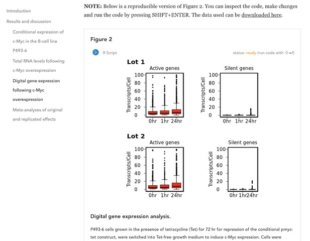

We are very excited to be a part of the  Reproducible Document Stack (RDS) project led by eLife Innovation. eLife just published 
an article on one of the main outputs, computationally reproducible manuscripts.

> In September 2017 eLife announced the start of the Reproducible Document Stack (RDS) project, a collaboration between Substance, Stencila and eLife to support the development of an open-source technology stack aimed at enabling researchers to publish reproducible manuscripts through online journals. Reproducible manuscripts enrich the traditional narrative of a research article with code, data and interactive figures that can be executed in the browser, downloaded and explored, giving readers a direct insight into the methods, algorithms and key data behind the published research.

Read the [full article on the eLife website](https://elifesciences.org/labs/ad58f08d/introducing-elife-s-first-computationally-reproducible-article).

You can launch the reproducible article example [here](https://repro.elifesciences.org/example.html#).