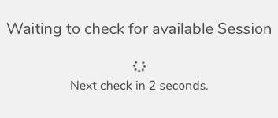

Stencila Hub is the web application that allows users to easily use Stencila's tools for executable documents without having to install them on their own machine. In addition, the Hub allows users to manage projects, accounts, teams, execution sessions and remote code and data sources. Since February we have mostly been working on invisible changes to improve reliability, but there have also been a few small but important style updates.

## Style Updates

Stencila's new Product Designer, Jacqueline, joined us in March, and quickly got to work on Stencila Hub. Her first task was to review and begin standardising some of its look and feel. Here's a quick before and after of the Projects List screen.

You will have noticed other improvements to the consitency of buttons and general UX. There are more changes to come as we redesign some of the interface to support upcoming features, and we will announce them as they are released. But you will also see consistent incremental improvements to the UI until then.

## Session Queueing

When launching a Stencila Desktop session through Stencila Hub, there is a chance that an execution host is not ready and has to be started. This might take a couple of minutes – although we have work in the pipeline to reduce startup time in the future. While session queueing is not new to Stencila Hub, we have made a number of improvements to the reliability.

The above spinner is probably something you have seen before when launching Stencila Desktop. It might take a minute or two to get a session but with the improvements we have done there shouldn't be any timeouts or errors – it will launch eventually.

## Deployment

As well as the improvements to the deployment process (explained in the [New Deployment Process blog post](/blog/2019-04-17-consistent-versioning-deployment-django-express/)) there have also been a few Hub specific changes. The load balancer uses the `system-status` endpoint to check if a deployment instance is ready to receive connections. It now returns an error if there are unapplied Django migrations. This means that connections will continue to be served by an existing instance until the database is in sync with the application code. Once the migration occurs requests will automatically be sent to the new instance.

We've also updated the Kubernetes deployment script to use rolling updates. We can now roll out updates and because the load balancer and Kubernetes checks the `system-status` endpoint, it waits until the new deployment is ready before switching over. Once it's ready the switch is instantaneous so we can deploy Hub (or Stencila Cloud) with no downtime.

## Internet Explorer Deprecation

Due to the use of some advanced JavaScript features, Stencila Hub has never really supported Internet Explorer. In the past, there was no notification of this to Internet Explorer users. Now, Internet Explorer users get their own special screen to let them know they are on an unsupported browser, instead of things just failing for no reason.

Our roadmap includes a fully enumerated list of supported browsers and we may later down-compile ES2015+ to JavaScript using Babel (or similar) to add Internet Explorer support, but there are no concrete plans surrounding that yet.

## Conclusion

Thank you for reading about our latest changes to Stencila Hub. We have more updates in the works focusing on UI enhancements and integration with more third party services.

If you like staying up to date with Stencila's progress you can join our monthly [Catching up with Stencila](meet.google.com/tpe-pgxz-oao) Google Meetup. They take place 8-9PM UTC on the first Monday of every month, the next one is scheduled for the 6th of May. We will be discussing both Hub and our other projects. We hope to see you there!
