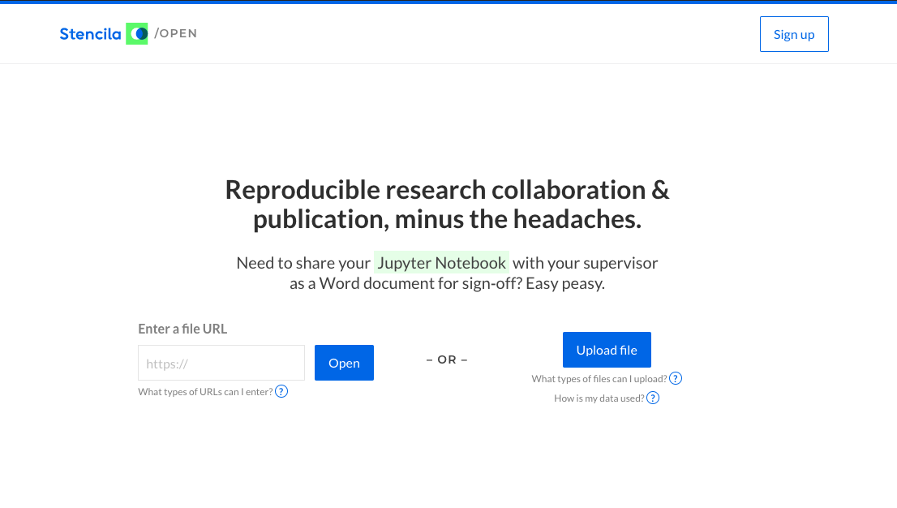

We’re happy to announce Stencila Open, a preview to our pre-print publishing and file conversion capabilities.

## What we learned from researchers

When we spoke with researchers, we learned of two major pain-points during the research paper authoring and publication process.
1. Researchers worked in teams with contributors whose authoring workflows and technical skill levels ranged from highly technical (programmatically generated executable documents and notebooks) to less technical (little to no programming experience, and a workflow primarily consisting of Word and Excel). To collaborate, researchers would encourage less technical colleagues to adopt more technical workflows, or manually convert executable files to non-executable, non-reproducible documents (e.g. PDFs and Word files).
2. Researchers don’t have a way of maintaining reproducibility in their published documents. During later stages of the authoring and publishing process, generated figures end up being copy-and-pasted as static images into Word and PDF files.

## How Stencila Open can help

Stencila aims to provide researchers with a set of tools that enable seamless collaboration, and reproducible, published documents. Stencila Open bridges the gap between reproducible documents and legacy formats (e.g. Word documents) by using rPNGs, or reproducible PNGs, which are static images and figures that contain the underlying code used to generate them. Our [file converters](http://github.com/stencila/encoda) generate rPNGs for non-executable file formats (e.g. Google Docs, Word files, and PDFs) to enable collaboration between researchers authoring their documents in workflows of varying technical levels. Using Stencila, a researcher can share a link to a Stencila Open publication preview of a Jupyter Notebook or RMarkdown file, for example, and their collaborator could view the document in an easy-to-read format, and download a reproducible Word document (containing rPNGs) or Google Doc to review and edit. Instead of having to generate and work with non-reproducible Word or PDF files, Stencila provides a powerful set of converters, built with reproducibility in mind.

We’d love for you to give [Stencila Open](https://hub.stenci.la/open/) a spin, and share any feedback on the conversions and pre-print previews so we can improve them. Thank you!

---

## October Community Call and Stencila Open Demo

In our October community call, Ben demoed Executa (remote code executors), and Jacqueline gave an overview of Stencila Open.

<iframe width="560" height="315" src="https://www.youtube.com/embed/3Q2-yaBTVZQ" frameborder="0" allow="accelerometer; autoplay; encrypted-media; gyroscope; picture-in-picture" allowfullscreen></iframe>

You can watch a recording of our community call [here](https://youtu.be/3Q2-yaBTVZQ), and [view our accompanying slides](https://docs.google.com/presentation/d/1mFQEOhx2NtRP4pJ9HVmYT96QX5stfMV1SZs19QVCkn0/edit?usp=sharing).

---

Feel free to reach out to us on [Zulip](http://stencila.zulipchat.com/), or join us for our next call, on November 6 9am PST / November 6 12pm EST / November 7 6am NZST by registering here: [https://zoom.us/webinar/register/WN_mnVgZtNEQXezMtDtSz6VaA?timezone_id=America%2FLos_Angeles](https://zoom.us/webinar/register/WN_mnVgZtNEQXezMtDtSz6VaA?timezone_id=America%2FLos_Angeles)
